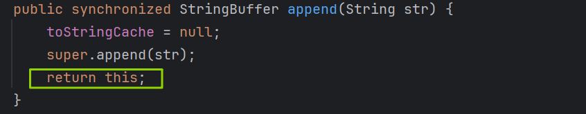

# 1、String类的常用方法

## 1.1 获取字符串信息

`int length()`

返回字符串的长度  
```java
int len = str.length();
```

`char charAt(int index)`

返回指定索引处的字符

```java
char c = str.charAt(0);
```

`boolean isEmpty()`

判断字符串是否为空（长度是否为 0）

```java
boolean empty = str.isEmpty();
```

------

## 1.2 大小写转换

`String toLowerCase()`

将字符串转换为小写（默认语言环境）

```java
String lower = str.toLowerCase();
```

`String toUpperCase()`

将字符串转换为大写（默认语言环境）

```java
String upper = str.toUpperCase();
```

------

## 1.3 字符串处理

`String trim()`

去除字符串首尾的空白字符

```java
String result = str.trim();
```

`String substring(int beginIndex)`

从指定位置开始截取子字符串

```java
String sub = str.substring(2);
```

`String substring(int beginIndex, int endIndex)`

截取指定范围的子字符串（左闭右开）

```java
String sub = str.substring(2, 5);
```

------

## 1.4 字符串比较

`boolean equals(Object obj)`

比较字符串内容是否相同

```java
boolean flag = str1.equals(str2);
```

`boolean equalsIgnoreCase(String anotherString)`

比较字符串内容是否相同（忽略大小写）

```java
boolean flag = str1.equalsIgnoreCase(str2);
```

`int compareTo(String anotherString)`

比较两个字符串的大小（按字典顺序）

```java
int result = str1.compareTo(str2);
```

------

## 1.5 字符串拼接

`String concat(String str)`

将指定字符串拼接到当前字符串末尾（等价于 `+`）

```java
String result = str1.concat(str2);
// 或
String result = str1 + str2;
```

----

## 1.6 字符串查找与匹配 

`boolean endsWith(String suffix)`

测试此字符串是否以指定的后缀结束

```java
String str1 = "helloworld";
boolean b1 = str1.endsWith("rld");
```

`boolean startsWith(String prefix)`

测试此字符串是否以指定的前缀开始

```java
String str1 = "helloworld";
boolean b2 = str1.startsWith("He");
```

`boolean startswith(String prefix，int toffset)`

测试此字符串从指定索引开始的子字符串是否以指定的前缀开始

```java
String str1 = "helloworld";
boolean b3 = str1.startsWith("11", 2);
```

`boolean contains(CharSequence s)`

当且仅当此字符串包含指定的 char 值序列时，返回true

```java
String str1 = "helloworld";
String str2 = "wor";
System.out.println(str1.contains(str2));
```

`int indexOf(String str)`

返回指定子字符串在此字符串中第一次出现处的索引

```java
String str1 = "helloworld";
System.out.println(str1.indexOf("lol"));
```

`int indexOf(String str,int fromIndex)`

返回指定子字符串在此字符串中第一次出现处的索引，从指定的索引开始

```java
String str1 = "helloworld";
System.out.println(str1.indexOf("lo",5));
```

`int lastIndexOf(String str)`

返回指定子字符串在此字符串中最右边出现处的索引

```java
String str3 = "hellorworld";
System.out.println(str3.lastIndexOf("or"));
```

`int lastlndexOf(String str,int fromlndex)`

返回指定子字符串在此字符串中最后次出现处的索引，从指定的索引开始**反向搜索**（从后往前找）

```java
String str3 = "hellorworld";
System.out.println(str3.lastIndexOf("or", 6));
```

注：`indexOf`和`lastlndexOf`方法如果未找到都是返回`-1`

---

## 1.7 字符串替换方法

`String replace(char oldChar,char newChar)`

返回一个新的字符串，它是通过用newChar替换此字符串中出现的所有oldchar得到的。

````java
String str1 = "咕噜咕噜咚";
String str2 = str1.replace('咕','嘟');
System.out.println(str1);
System.out.println(str2);

````

`String replace(CharSequence target, CharSequence replacement)`

使用指定的字面值替换序列替换此字符串所有匹配字面值目标序列的子字符串。

```java
String str1 = "咕噜咕噜咚";
String str3 = str1.replace("咕噜", "嘟呜");
System.out.println(str3);
```

---

## 1.8 正则匹配与替换

`String replaceAll(String regex, String replacement)`

使用给定的replacement替换此字符串所有匹配给定的正则表达式的子字符串。

```java
String str = "123java456mysql21345spring215mybatis4444"
// 把字符串中的数字替换成，，如果结果中开头和结尾有，的话去掉
String string = str.replaceAll("\\d+",",").replaceAll("^,|,$","");
System.out.println(string);
```

`String replaceFirst(String regex, String replacement)`

使用给定的replacement替换此字符串匹配给定的正则表达式的第一个子字符串。

```java
String str = "12345";//判断str字符串中是否全部有数字组成，即有1-n个数字组成
boolean matches = str.matches("\\d+");
System.out.println(matches);
```

`boolean matches(String regex)`

告知此字符串是否匹配给定的正则表达式。

```java
String tel = "0571-4534289";
//判断这是否是一个杭州的固定电话
boolean result = tel.matches("0571-\\d{7,8}");
System.out.println(result);
```

---

## 1.9 字符串拆分

`String[] split(String regex)`

根据给定正则表达式的匹配拆分此字符串。

```java
String str = "hello|world|java";
String[] strs = str.split("\\|");
for (int i = 0; i < strs.length; i++) {
    System.out.println(strs[i]);
}
```

`String[] split(String regex,int limit)`

根据匹配给定的正则表达式来拆分此字符串，最多不超过limit个，如果超过了，剩下的全部都放到最后一个元素中。

```java
String str2 = "hello.world.java";
String[] strs2 = str2.split("\\.");
for (int i = 0; i < strs2.length; i++){
    System.out.println(strs2[i]);
}
```

# 2、String与基本数据类型转换

- 字符串→基本数据类型、包装类
  - `Integer包装类`的`public static int parselnt(String s)`方法可以将由 “**数字**”字符组成的字符串转换为整型。
  - 类似地，使用java.lang包中的Byte、Short、Long、Float、Double类调相应的类方法可以将由“**数字**”字符组成的字符串，转化为相应的基本数据类型。
- 基本数据类型、包装类→字符串
  - 调用`String类`的`public String valueOf(int n)`可将`int型`转换为字符串
  - 相应`valueOf(byte b)、valueOf(long I)、valueOf(float f)、valueOf(doubled)、valueOf(boolean b)`可由参数的相应类型到字符串的转换

```java
String str1 = "123";
// 字符串 -> int
// int num = (int) str1; //错误的
int num = Integer.parseInt(str1);
// int -> 字符串
String str2 = String.valueOf(num);
String str3 = num+"";
System.out.println(str2);
System.out.println(str3);
```

## 2.1 String与字符数组之间的转换

**字符串→字符数组**

`String --> char[]`

调用String的`toCharArray()`/`public void getChars(int srcBegin, int srcEnd, char dst[], int dstBegin) `方法

```java
// getChars(int srcBegin, int srcEnd, char dst[], int dstBegin)
String str1 = "abc123";
char[] charArray1 = new char[str1.length()];
str1.getChars(0,6,charArray1,0);
for (int i = 0; i < charArray1.length; i++) {
    System.out.println(charArray1[i]);
}
// toCharArray()
str1 = "abc123";
char[] charArray = str1.toCharArray();
for (int i = 0; i < charArray.length; i++) {
    System.out.println(charArray[i]);
}
```

**字符数组→字符串**

`char[]-->String`

调用String的构造器

- `String(char[])`
- `String(char[],int offset,int length)`

```java
// String(char[])
char[] arr = new char[]{'h','e','l','l','o'};
String str2 = new String(arr);
System.out.println(str2);
// String(char[],int offset,int length)
String str3 = new String(arr,1,3);
System.out.println(str3);
```

## 2.2 String与字节数组之间的转换

**字符串→字节数组**

> 编码：字符串→字节（看得懂→看不懂的二进制数据）

调用String的`public byte[] getBytes()`/`public byte[] getBytes(String charsetName) `方法

```java
String str1 = "abc123中国";
byte[] bytes = str1.getBytes();// 使用默认字符集，进行转换
System.out.println(Arrays.toString(bytes));

byte[] gbks = str1.getBytes("gbk");
System.out.println(Arrays.toString(gbks));
```


**字节数组→字符串**

> 解码：编码的逆过程，字节→字符串（看不懂的二进制数据→看得懂）

调用String的构造器

- `String(byte[])`
- `String(byte[],int offset,int length)`

```java
// 使用默认字符集进行解码
String s = new String(bytes);
System.out.println(s);
String s1 = new String(gbks, "gbk");
System.out.println(s1);
String s2 = new String(gbks);
System.out.println(s2);
```

>说明：解码时，要求解码使用的字符集必须与编码时使用的字符集一致，否则会出现乱码。

# 3、String/StringBuffer/StringBuilder类

## 3.1 String、StringBuffer、StringBuilder三者的异同

`String`：不可变(`final`)的字符序列；底层使用char[]存储

`StringBuffer`：可变的字符序列；线程安全的，效率低；底层使用char[]存储

`StringBuilder`：可变的字符序列；jdk5.0新增的，线程不安全的，效率高；底层使用char[]存储

## 3.2 StringBuffer源码分析

```java
String str = new String();//char[] value = new char[0];
String str1 = new String("abc");//char[] value = new char[]{'a','b','c'};

StringBuffer sb1 = new StringBuffer();//char[] value = new char[16]; 底层创建了一个长度为16的字符数组
sb1.append('a');//value[0]='a';
sb1.append('b');//value[1]='b';

StringBuffer sb2 = new StringBuffer("abc");//char[]value = new char["abc".length()+16];

//问题1.System.out.println(sb2.length());//3
//问题2.扩容问题：如果要添加的数据底层数组盛不下了，那就需要扩容底层的数组。
//	   默认情况下，扩容为原来容量的2倍+2，同时将原有数组中的元素复制到新的数组中。
//	   开发中建议大家使用:StringBuffer(int capacity)或 StringBuilder(int capacity)
```

## 3.3 StringBuffer中的常用方法

### 3.3.1 字符串操作方法

**拼接**

- `StringBuffer append(xxx)`

用于字符串拼接，支持多种数据类型，是最常用的方法 

```java
sb.append("hello").append(" world");
```

---

**删除**

- `StringBuffer delete(int start, int end)`

删除指定范围的字符（左闭右开）

```java
sb.delete(0, 2);
```

------

**替换**

- `StringBuffer replace(int start, int end, String str)`

将指定区间的内容替换为新字符串

```java
sb.replace(0, 2, "hi");
```

------

**插入**

- `StringBuffer insert(int offset, xxx)`

在指定位置插入内容

```java
sb.insert(1, "abc");
```

------

**反转**

- `StringBuffer reverse()`

将字符序列反转

```java
sb.reverse();
```

---

当`append`和`insert`时，如果原来value数组长度不够，可扩容。

如上这些方法支持`方法链`操作。

StringBuffer 支持方法链调用，例如：

```java
sb.append("a").append("b").append("c");
```

**原理：**

- 方法返回的是 `this`（当前对象）
- 因此可以连续调用多个方法



### 3.3.2 查询相关方法

- `int indexOf(String str)`
   返回子字符串第一次出现的位置
- `String substring(int start, int end)`
   截取子字符串（左闭右开）
- `int length()`
   返回当前长度
- `char charAt(int n)`
   获取指定位置字符
- `void setCharAt(int n, char ch)`
   修改指定位置字符

---

**方法总结：**

增：`append(xxx)`

删：`delete(int start,int end)`

改： `setCharAt(int n ,char ch)` / `replace(int start, int end, String str)`

查：`charAt(int n)`

插：`insert(int offset,xxx)`

长度：`length();`

遍历：`for()+charAt()`/`toString()`
