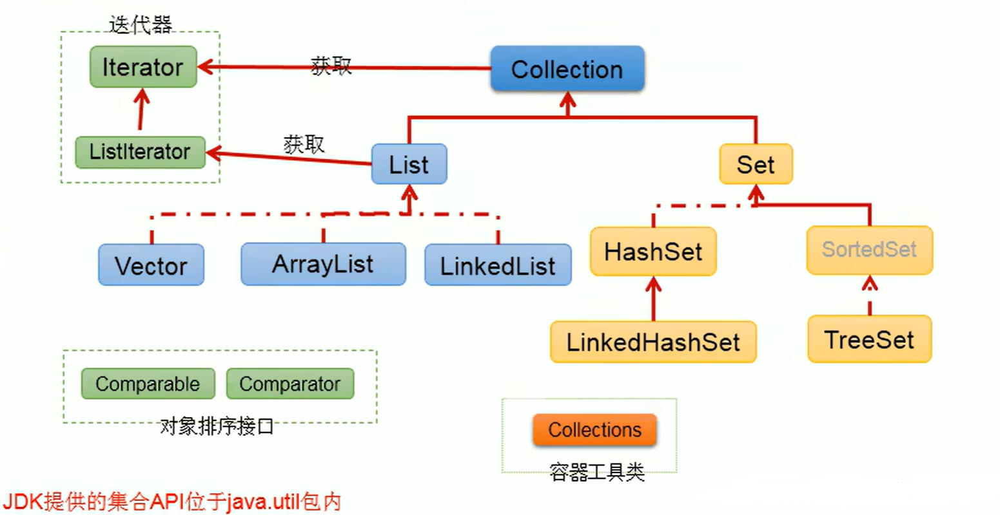
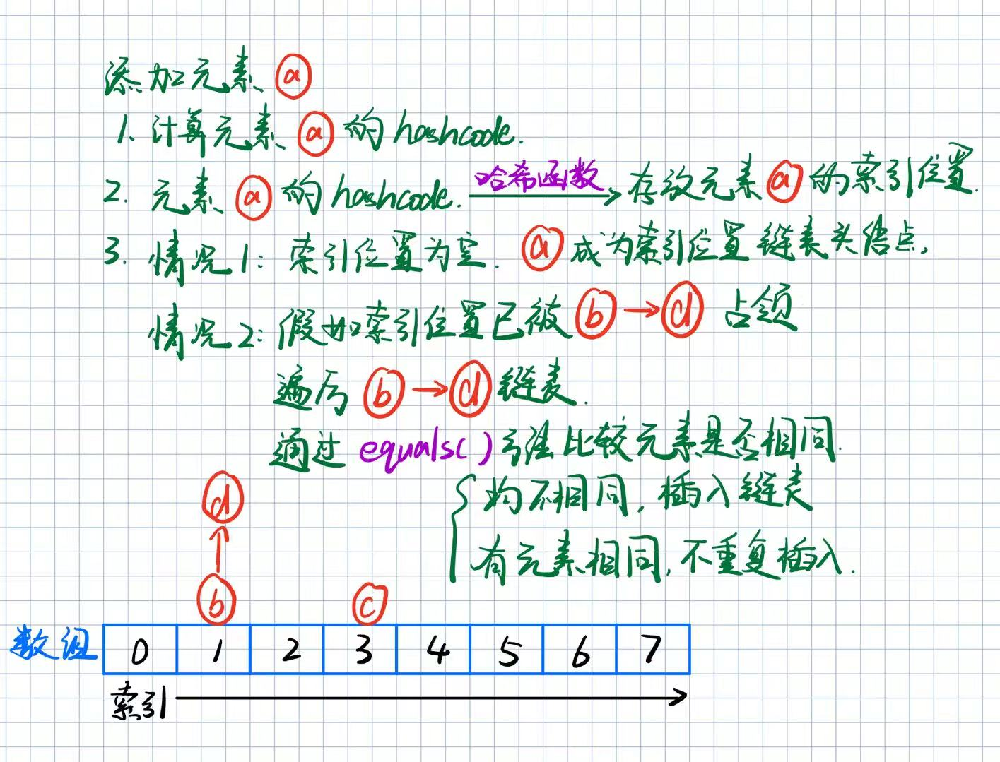
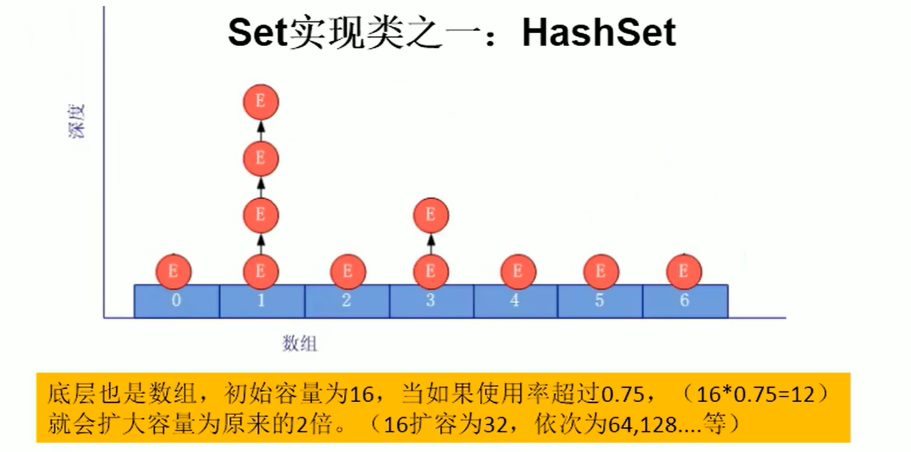
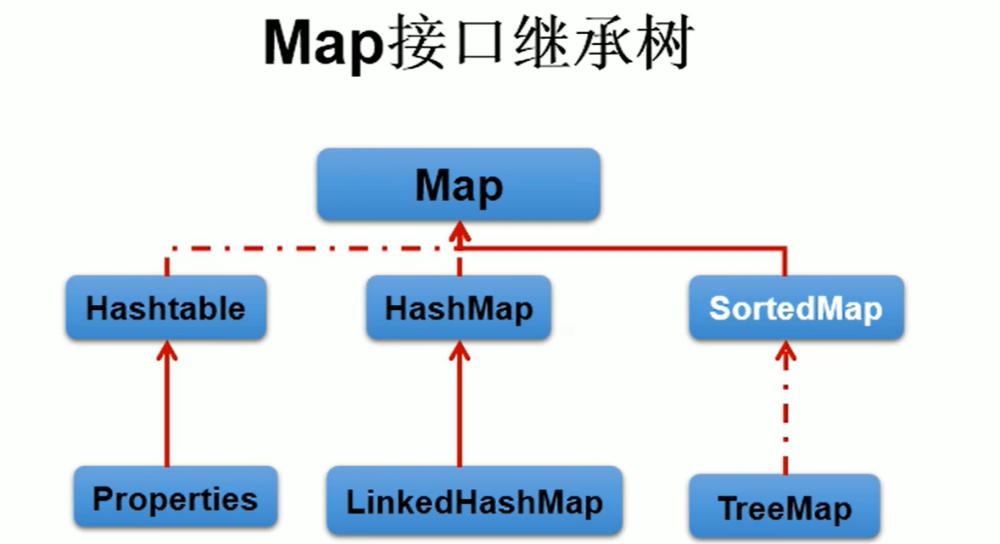

# Java 集合体系详解：Collection、List、Set、Map

## 1、数组与集合

### 1.1、集合与数组存储数据概述

集合、数组都是对多个数据进行存储操作的结构，简称Java容器

说明：此时的存储，主要指的是内存层面的存储，不涉及到持久化的存储(.txt，.jpg，.avi，数据库中)

### 1.2、数组存储的特点

一旦初始化以后，其长度就确定了。

数组一旦定义好，其元素的类型也就确定了。我们也就只能操作指定类型的数据了。

比如:String[] arr;int[] arr1;Object[] arr2;

### 1.3、数组存储的弊端

一旦初始化以后，其长度就不可修改。

数组中提供的方法非常限，对于添加、删除、插入数据等操作，非常不便，同时效率不高。

获取数组中实际元素的个数的需求，数组没有现成的属性或方法可用

数组存储数据的特点：有序、可重复。对于无序、不可重复的需求，不能满足。

### 1.4、集合存储的优点

解决数组存储数据方面的弊端。

## 2、Collection接口

### 2.1、单列集合框架结构

Collection接口：单列集合，用来存储一个一个的对象

List接口：存储序的、可重复的数据。 →“动态”数组，替换原有的数组

面试题：ArrayList、LinkedList、Vector三者的异同？

同：三个类都是实现了List接口，存储数据的特点相同：存储有序的、可重复的数据

不同：

- Arraylist：作为List接口的主要实现类，线程不安全的，效率高；底层使用Object[] elementData存储
- Linkedlist ：对于频繁的插入、删除操作，使用此类效率比ArrayList高；底层使用双向链表存储
- Vector：作为List接口的古老实现类，线程安全的，效率低；底层使用Object[] elementData存储

Set接口:存储无序的、不可重复的数据→高中讲的“集合”

- HashSet、 LinkedHashSet、 TreeSet

对应图示：



### 2.2、ArrayList

ArrayList的源码分析：

**jdk 7情况下**

```java
ArrayList list= new Arraylist();// 底层创建了长度是10的Object[]数组elementData
list.add(123);// elementData[e] = new Integer(123);
...
list.add(11);// 如果此次的添加导致底层elementData数组容量不够，则扩容
// 默认情况下，扩容为原来的容量的1.5倍，同时需要将原有数组中的数据复制到新的数组中。

// 结论:建议开发中使用带参的构造器:ArrayList List = new ArrayList(int capacity)
```

**jdk 8中ArrayList的变化**

```java
ArrayList list= new Arraylist();// 底层Object[]elementData初始化为{}，并没有创建长度为10的数组
list.add(123);// 第一次调用add()时，底层才创建了长度10的数组，并将数据123添加到数组elementData
...
// 后续的添加和扩容操作与jdk7无异。
```

小结：jdk7中的ArrayList的对象的创建类似于单例的饿汉式，而jdk8中的ArrayList的对象的创建类似于单例的懒汉式，延迟了数组的创建，节省内存。

### 2.3、LinkedList

LinkedList的源码分析：

```java
LinkedList list= new LinkedList();// 内部声明了Node类型的first和Last属性，默认值为null
List.add(123);// 将123封装到Node中，创建了Node对象。
// 其中，Node定义为: 体现了LinkedList的双向链表的说法
private static class Node<E> {
    E item;
    Node<E> next;
    Node<E> prev;

    Node(Node<E> prev, E element, Node<E> next) {
        this.item = element;
        this.next = next;
        this.prev = prev;
    }
}
```

### 2.4、List接口中的常用方法

```java
/**
void add(int index,Object ele):在index位置插入ele元素

boolean addAll(int index,Collection eles):从index位置开始将eles中的所有元素添加进来

Object get(int index):获取指定index位置的元素

int indexof(object obj):返回obj在集合中首次出现的位置，如果不存在，返回-1

int LastIndexOf(0bject obj):返回obj在当前集合中末次出现的位置，如果不存在，返回-1

Object remove(int index):移除指定index位置的元素，并返回此元素

Object set(int index，Object ele):设置指定index位置的元素为ele

List sublist(int fromIndex, int toIndex):返回从fromIndex到toIndex位置的左闭右开子集合

*/
```

**总结:常用方法**
增：`add(Object obj)`

删：`remove(int index)/ remove(Object obj)`

改：`set(int index,Object ele)`

查：`get(int index)`

插： `add(int index, Object ele)`

长度：`size()`

遍历：① Iterator迭代器方式

​	   ② 增强for循环

​	   ③ 普通的循环

**List 哪些方法必须依赖 equals ()？**

| 方法                      | 作用               | 不重写 equals 的后果 |
| ------------------------- | ------------------ | -------------------- |
| `contains(Object o)`      | 判断是否包含该元素 | 永远返回 false       |
| `indexOf(Object o)`       | 获取元素下标       | 永远返回 - 1         |
| `lastIndexOf(Object o)`   | 获取最后出现的下标 | 永远返回 - 1         |
| `remove(Object o)`        | 删除指定元素       | 删不掉、不生效       |
| `removeAll(Collection c)` | 批量删除           | 无法匹配删除         |
| `retainAll(Collection c)` | 保留交集           | 无法匹配保留         |

### 2.5、Collection集合与数组间的转换

```java
//集合--->数组:toArray()
Object[] arr = coll.toArray();
for(int i = 0;i < arr.length;i++){
    System.out.println(arr[i]);
}
//拓展:数组--->集合:调用Arrays类的静态方法asList(T ... t)
List<String> list = Arrays.aslist(new String[]{"AA", "BB", "CC"});
System.out.println(list);

List arr1 = Arrays.asList(new int[]{123, 456});
System.out.println(arr1.size());//1

List arr2 = Arrays.aslist(new Integer[]{123, 456});
System.out.println(arr2.size());//2
```


### 2.6、Set接口

Set接口：存储无序的、不可重复的数据→高中讲的集合

1. Set接口中没有额外定义新的方法，使用的都是Collection中声明过的方法。
2. 要求：向 Set 中添加的数据，其所在的类一定要重写 `hashcode()` 和 `equals()` 

​	重写的 `hashCode()` 和 `equals()` 尽可能保持一致性：相等的对象必须具有相等的散列码

​	重写两个方法的小技巧：对象中用作 `equals()` 方法比较的Field，都应该用来计算hashCode

- HashSet：作为Set接口的主要实现类；线程不安全的；可以存储null值
  - LinkedHashset：作为Hashset的子类；遍历其内部数据时，可以按照添加的顺序遍历，在添加数据的同时，每个数据还维护了两个引用，记录此数据前一个数据和后一个数据。对于频繁的遍历操作，LinkedHashSet效率高于HashSet。
- TreeSet：可以按照添加对象的指定属性，进行排序。

**以HashSet为例说明：**

1、无序性：不等于随机性。存储的数据在底层数组中并非按照数组索引的顺序添加，而是根据数据的哈希值决定的。

2、不可重复性：保证添加的元素按照`equals()`判断`HashCode`时，不能返回true。即：相同的元素只能添加一个。

**添加元素的过程：以HashSet为例：**

我们向HashSet中添加元素a，首先调用元素a所在类的hashCode()方法，计算元素a的哈希值，此哈希值接着通过某种算法计算出在HashSet底层数组中的存放位置（即为：索引位置），判断数组此位置上是否已经有元素：

- 如果此位置上没有其他元素，则元素a添加成功。——情况1
- 如果此位置上有其他元素b（或以链表形式存在的多个元素），则比较元素a与元素b的hash值：
  - 如果hash值不相同，则元素a添加成功。——情况2
  - 如果hash值相同，进而需要调用元素a所在类的equals()方法：
    - equals()返回true，元素a添加失败
    - equals()返回false，则元素a添加成功。——情况3

对于添加成功的情况2和情况3而言：元素 a 与已经存在指定索引位置上数据以链表的方式存储。

jdk 7 ：元素a放到数组中，指向原来的元素。

jdk 8 ：原来的元素在数组中，指向元素a。

总结：七上八下。

**插入图示如下**



**HashSet底层：数组+链表的结构。**



**问题：为什么用Eclipse/IDEA复写hashcode方法，有31这个数字？**

- 选择系数的时候要选择尽量大的系数。因为如果计算出来的hash地址越大，所谓的“冲突”就越少，查找起来效率也会提高。(减少冲突)
- 并且31只占用5bits，相乘造成数据溢出的概率较小。
- 31可以 由 `i*31==(i<<5)-1` 来表示,现在很多虚拟机里面都有做相关优化。(提高算法效率)
- 31是一个素数，素数作用就是如果我用一个数字来乘以这个素数，那么最终出来的结果只能被素数本身和被乘数还有1来整除！（减少冲突）

### 2.7、TreeSet

1.向TreeSet中添加的数据，要求是相同类的对象。

2.两种排序方式:自然排序(实现Comparable接口)和定制排序(Comparator)

3.自然排序中，比较两个对象是否相同的标准为：`compareTo()`返回0，不再是`equals()`

```java
public class User implements Comparable{
    private String name;
    private int age;
    ...
    //按照姓名从小到大排列
	@0verride
    public int compareTo(Object o) {
        if(o instanceof User){
			User user = (User)o;
			return this.name.compareTo(user.name);
        }else{
            throw new RuntimeException("输入的类型不匹配");
        }
    }

}
```


4.定制排序中，比较两个对象是否相同的标准为：`compare()`返回0，不再是`equals()`


```java
Comparator com = new Comparator() {
    //按照年龄从小到大排列
    @override
	public int compare(Object o1, Object o2) {
        if (o1 instanceof User && o2 instanceof User){
            User u1 = (User)o1;
            User u2 = (User)o2;
			return Integer.compare(u1.getAge(),u2.getAge());
        }else{
            throw new RuntimeException("输入的数据类型不匹配");
        }
    };
TreeSet set = new TreeSet(com);
```

## 3、Map接口

