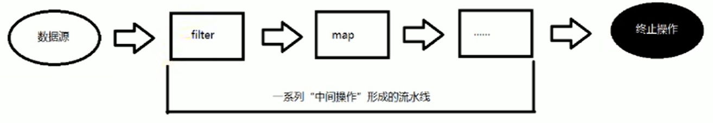

# 1、Lambda表达式

## 1.1、为什么使用Lambda表达式

Lambda是一个**匿名函数**，我们可以把Lambda表达式理解为是一段可以**传递的代码**（将代码像数据一样进行传递）。使用它可以写出更简洁、更灵活的代码。作为一种更紧凑的代码风格，使Java的语言表达能力得到了提升。

**Lambda表达式的本质**：作为**函数式接口**的实例

## 1.2、Lambda表达式的使用

### 1.2.1、举例

像重写Comparator中的compare方法：

```java
(o1,o2) -> Integer.compare(o1,o2);
```

### 1.2.2、格式

`->`：lambda操作符 或 箭头操作符

`->左边`：Lambda形参列表 (其实就是接口中的抽象方法的形参列表)

`->右边`：Lambda体(其实就是重写的抽象方法的方法体)

## 1.3、Lambda表达式的六种使用情况

`->左边`：Lambda形参列表的参数类型可以省略(类型推断)；如果Lambda形参列表只有一个参数，则那一对( )也可以省略。

`->右边`：Lambda体应该使用一对{}包裹：如果Lambda体只有一条执行语句(可能是return语句)，可以省略这一对{}和return关键字。

### 1.3.1、语法格式一：无参，无返回值

示例代码：

```java
    @Test
    public void test() {

        Runnable r1 = new Runnable() {
            @Override
            public void run() {
                System.out.println("Hello World!");
            }
        };
        r1.run();

        System.out.println("*******************************");
		// Lambda表达式重写
        Runnable r2 = () -> System.out.println("Bye World!");
        r2.run();

    }
```

### 1.3.2、语法格式二：Lambda 需要一个参数，但是没有返回值

示例代码：

```java
    @Test
    public void test2() {

        Consumer<String> c1 = new Consumer<String>() {
            @Override
            public void accept(String s) {
                System.out.println(s);
            }
        };

        c1.accept("Hello World!");
        System.out.println("*******************************");
        
        // 给定参数 String s
        Consumer<String> c2 = (String s) -> System.out.println(s);
        c2.accept("Bye World!");

    }
```

### 1.3.3、语法格式三：数据类型可以省略，因为可由编译器推断得出，称为“类型推断”

示例代码：

```java
    @Test
    public void test3() {

        // 给定参数 String s
        Consumer<String> c1 = (String s) -> System.out.println(s);
        c1.accept("Hello World!");

        System.out.println("*******************************");

        // 给定参数 s
        // 编译器推断得出参数类型
        Consumer<String> c2 = (s) -> System.out.println(s);
        c2.accept("Bye World!");

    }
```

### 1.3.4、语法格式四：Lambda若只需要一个参数时，参数的小括号可以省略

示例代码：

```java
@Test
public void test4() {
    // 给定参数 String s
    Consumer<String> c1 = (s) -> System.out.println(s);
    c1.accept("Hello World!");

    System.out.println("*******************************");

    // 给定参数 s
    // Lambda若只需要一个参数时，参数的小括号可以省略
    Consumer<String> c2 = s -> System.out.println(s);
    c2.accept("Bye World!");
}
```

### 1.3.5、语法格式五：Lambda 需要两个或以上的参数，多条执行语句，并且可以有返回值

示例代码：

```java
@Test
public void test5() {

    Comparator<Integer> com1 = new Comparator<Integer>() {
        @Override
        public int compare(Integer o1, Integer o2) {
            System.out.println(o1);
            System.out.println(o2);
            return o1.compareTo(o2);
        }
    };

    System.out.println(com1.compare(1, 2));
    System.out.println("*************************************");

    Comparator<Integer> com2 = (o1, o2) -> {
        System.out.println(o1);
        System.out.println(o2);
        return o1.compareTo(o2);
    };
    System.out.println(com2.compare(12, 2));

}
```

### 1.3.6、语法格式六：当Lambda体只有一条语句时，若有return 与大括号，都可以省略

示例代码：

```java
@Test
public void test6() {

    Comparator<Integer> com1 = (o1, o2) -> {return o1.compareTo(o2);};

    System.out.println(com1.compare(1, 2));
    System.out.println("*************************************");

    Comparator<Integer> com2 = (o1, o2) -> o1.compareTo(o2);
    System.out.println(com2.compare(12, 2));

}
```


# 2、函数式接口

## 2.1、什么是函数式接口

只包含一个抽象方法的接口，称为**函数式接口**。

你可以通过**Lambda表达式**来创建该接口对象。(若 Lambda 表达式抛出一个受检异常(即：非运行时异常)，那么该异常需要在目标接口的抽象方法上进行声明)。

我们可以在一个接口上使用**@FunctionalInterface**注解，这样做可以检查它是否是一个函数式接口。同时javadoc也会包含一条声明，说明这个接口是一个函数式接口。
在 java.util.function 包下定义了Java 8的丰富的函数式接口

## 2.2、Java内置四大核心函数式接口

### 2.2.1、Consumer消费者接口

`Consumer<T>` —— 对类型为T的对象应用操作，包含方法：`void accept(T t)`

```java
    // --------------- Consumer 消费者接口 ---------------
    public void happyTime(double money, Consumer<Double> con) {
        con.accept(money);
    }

    @Test
    public void testConsumer() {
        // 匿名内部类写法
        happyTime(500, new Consumer<Double>() {
            @Override
            public void accept(Double aDouble) {
                System.out.println("学习太累了，去全家便利店买了瓶矿泉水，价格为：" + aDouble);
            }
        });

        System.out.println("********************");

        // Lambda 写法
        happyTime(400, money -> System.out.println("学习太累了，去全家便利店买了瓶矿泉水，价格为：" + money));
    }
```


### 2.2.2、Supplier供给型接口

返回类型为T的对象，包含方法：`T get()`

```java
    // --------------- Supplier 供给型接口 ---------------
    public String getSomething(Supplier<String> sup) {
        return sup.get();
    }

    @Test
    public void testSupplier() {
        // 匿名内部类写法
        String food1 = getSomething(new Supplier<String>() {
            @Override
            public String get() {
                return "吃顿大餐";
            }
        });
        System.out.println("匿名内部类：" + food1);

        System.out.println("********************");

        // Lambda 写法
        String food2 = getSomething(() -> "喝杯奶茶");
        System.out.println("Lambda：" + food2);
    }

```


### 2.2.3、Function函数型接口

对类型为`T`的对象应用操作，并返回结果。结果是`R`类型的对象。包含方法：`R apply(T t)`

```java
   // --------------- Function 函数型接口 ---------------
    public Integer strToLen(String str, Function<String, Integer> fun) {
        return fun.apply(str);
    }

    @Test
    public void testFunction() {
        // 匿名内部类写法
        Integer len1 = strToLen("hello", new Function<String, Integer>() {
            @Override
            public Integer apply(String s) {
                return s.length();
            }
        });
        System.out.println("匿名内部类：字符串长度 = " + len1);

        System.out.println("********************");

        // Lambda 写法
        Integer len2 = strToLen("lambda", s -> s.length());
        System.out.println("Lambda：字符串长度 = " + len2);
    }
```


### 2.2.4、Predicate断定型接口

确定类型为T的对象是否满足某约束，并返回`boolean`值。包含方法：`boolean test(T t)`

```java
   // --------------- Predicate 断定型接口 ---------------
    public boolean isAdult(int age, Predicate<Integer> pre) {
        return pre.test(age);
    }

    @Test
    public void testPredicate() {
        // 匿名内部类写法
        boolean r1 = isAdult(17, new Predicate<Integer>() {
            @Override
            public boolean test(Integer integer) {
                return integer >= 18;
            }
        });
        System.out.println("匿名内部类：是否成年？" + r1);

        System.out.println("********************");

        // Lambda 写法
        boolean r2 = isAdult(20, age -> age >= 18);
        System.out.println("Lambda：是否成年？" + r2);
    }
```


# 3、Stream API

## 3.1、Stream API说明

Java 8中有两大最为重要的改变。

第一个是**Lambda表达式**；另外一个则是 **Stream API**。

`Stream API (java.util.stream)`把真正的函数式编程风格引入到Java中。

这是目前为止对Java类库最好的补充，因为Stream API可以极大提供Java程序员的生产力，让程序员写出高效率、干净、简洁的代码。

Stream 是 Java8 中处理集合的关键抽象概念，它可以指定你希望对集合进行的操作，可以执行非常复杂的查找、过滤和映射数据等操作。

**使用 Stream API 对集合数据进行操作，就类似于使用 SQL 执行的数据库查询。**也可以使用 Stream API 来并行执行操作。简言之，Stream API提供了一种高效且易于使用的处理数据的方式。

## 3.2、为什么要使用Stream API

实际开发中，项目中多数数据源都来自于Mysql，Oracle等。但现在数据源可以更多了，有MongoDB，Redis等，而这些NoSQL的数据就需要Java层面去处理。

Stream 和 Collection集合的区别：**Collection是一种静态的内存数据结构，而Stream是有关计算的。**前者是主要面向内存，存储在内存中，后者主要是面向CPU，通过 CPU实现计算。

## 3.3、什么是 Stream

**Stream到底是什么呢?**
是数据渠道，用于操作数据源（集合、数组等）所生成的元素序列。

“集合讲的是数据，Stream讲的是计算!”

**注意：**
1、Stream自己不会存储元素。
2、Stream不会改变源对象。相反，他们会返回一个持有结果的新Stream。
3、Stream操作是延迟执行的。这意味着他们会等到需要结果的时候才执行。

## 3.4、Stream 操作的三个步骤

1、创建 Stream

一个数据源（如：集合、数组），获取一个流。

2、中间操作
一个中间操作链，对数据源的数据进行处理

3、终止操作（终端操作）
一旦执行终止操作，就执行中间操作链，并产生结果。之后，不会再被使用



## 3.5、创建Stream对象

### 3.5.1、方式一：通过集合

Java8中的`Collection`接口被扩展，提供了两个获取流的方法：

- `default Stream<E> stream()`：返回一个顺序流
- `default Stream<E> parallelStream()`： 返回一个并行流

```java
public void test() {
    List<Integer> list = Arrays.asList(1,2,3,4);
    // `default Stream<E> stream()`：返回一个顺序流
    Stream<Integer> stream = list.stream();
    // `default Stream<E> parallelStream()`： 返回一个并行流
    Stream<Integer> parallelStream = list.parallelStream();
}
```

### 3.5.2、方式二：通过数组

Java8中的`Arrays`工具类的静态方法`stream()`可以获取数组流：

- `static <T> Stream<T> stream(T[] array)`：返回一个流

重载形式，能够处理对应基本类型的数组：

- `public static IntStream stream(int[] array)`
- `public static LongStream stream(long[] array)`
- `public static DoubleStream stream(double[] array)`

```java
@Test
public void test2() {
    int[] arr = new int[]{1,2,3,4,5};
    // 调用`Arrays`工具类的静态方法`stream()`
    IntStream stream = Arrays.stream(arr);

    Person person = new Person("Jerry",13);
    Person person1 = new Person("Carl",14);
    Person[] persons = new Person[]{person,person1};
    Stream<Person> personStream = Arrays.stream(persons);

}
```

### 3.5.3、方式三：通过Stream的of()

可以调用Stream类静态方法`of()`，通过显示值创建一个流。它可以接收任意数量的参数。

- `public static<T> Stream<T> of(T... values)`： 返回一个流

```java
@Test
public void test3() {

    Stream<Integer> stream = Stream.of(1,2,3,4);

}
```

### 3.5.4、方式四：创建无限流

可以使用静态方法 `Stream.iterate()`和 `Stream.generate()`，创建无限流。

- 迭代

`public static<T> Stream<T> iterate(final T seed, final UnaryOperator<T> f)`

- 生成

`public static<T> Stream<T> generate(Supplier<T> s)`

```java
@Test
public void test4() {
    // 遍历前10个偶数
    Stream.iterate(0, t -> t + 2).limit(10).forEach(System.out::println);

    // 生成十个随机数
    Stream.generate(Math::random).limit(10).forEach(System.out::println);
}

```

## 3.6、Stream的中间操作

### 3.6.1、筛选与切片

`filter(Predicate p)`——接收 Lambda，从流中排除某些元素。

```java
        List<Person> persons = Arrays.asList(person1,person2,person3,person4,person5,person6,person7,person8);
        // filter(Predicate p) —— 接收 Lambda，从流中排除某些元素。
        Stream<Person> personStream = persons.stream();
        // 查询年龄大于4的人
        personStream.filter(person -> person.age > 4).forEach(System.out::println);
```

`limit(n)`——截断流，使其元素不超过给定数量。

```java
// limit(n) —— 截断流，使其元素不超过给定数量。
persons.stream().limit(3).forEach(System.out::println);
```

`skip(n) `—— 跳过元素，返回一个扔掉了前n个元素的流。若流中元素不足n个则返回一个空流

```java
// skip(n) —— 跳过元素，返回一个扔掉了前n个元素的流。若流中元素不足n个则返回一个空流
persons.stream().skip(6).forEach(System.out::println);
```

`distinct()` —— 筛选，通过流所生成元素的`hashCode()`和`equals()`去除重复元素

```java
        // distinct() —— 筛选，通过流所生成元素的hashCode()和equals()去除重复元素
        persons.add(new Person("Jerry",1));
        persons.add(new Person("Jerry",1));
        persons.add(new Person("Jerry",1));
        persons.add(new Person("Jerry",1));
        persons.add(new Person("Jerry",1));
        persons.stream().distinct().forEach(System.out::println);
```


### 3.6.2、映射

`map(Function f)` —— 接收一个函数作为参数，将元素转换成其他形式或提取信息，该函数会被应用到每个元素上，并将其映射成一个新的元素。

练习：获取姓名长度大于4的人的姓名。

```java
        // map(Function f) —— 接收一个函数作为参数，将元素转换成其他形式或提取信息，该函数会被应用到每个元素上，并将其映射成一个新的元素。
        List<String> list = Arrays.asList("aa","bb","cc","dd","ee");
        // 通过toUpperCase将每一个元素映射为新的String
        list.stream().map(String::toUpperCase).forEach(System.out::println);

        // 练习:获取姓名长度大于4的人的姓名。
        Person person1 = new Person("Jerry",1);
        Person person2 = new Person("Carl",2);
        Person person3 = new Person("Jay",3);
        Person person4 = new Person("Cali",4);
        Person person5 = new Person("Henry",5);
        Person person6 = new Person("Jack",6);
        Person person7 = new Person("Vero",7);
        Person person8 = new Person("Fiona",8);

        List<Person> persons = new ArrayList<>(Arrays.asList(
                person1,person2,person3,person4,
                person5,person6,person7,person8
        ));
        // 通过stream的映射将原本的Person流变成了String流
        Stream<String> stringStream = persons.stream().map(Person::getName);
        stringStream.filter(name -> name.length() > 4).forEach(System.out::println);

```


`flatMap(Function f)` —— 接收一个函数作为参数，将流中的每个值都换成另一个流，然后把所有流连接成一个流。

```java
    @Test
    public void test7() {
        // map(Function f) —— 接收一个函数作为参数，将元素转换成其他形式或提取信息，该函数会被应用到每个元素上，并将其映射成一个新的元素。
        List<String> list = Arrays.asList("aa","bb","cc","dd","ee");
        // 通过map和fromStringToStream方法将String list中每个字符输出
        // 先将String都变为Stream<Character>
        Stream<Stream<Character>> streamStream = list.stream().map(StreamAPITest::fromStringToStream);
        // 再遍历5个Stream，通过Stream内部遍历再输出字符
        streamStream.forEach(stream -> stream.forEach(System.out::println));

        // flatMap(Function f) —— 接收一个函数作为参数，将流中的每个值都换成另一个流，然后把所有流连接成一个流。
        // 这里比起map映射要少一个Stream嵌套
        Stream<Character> characterStream = list.stream().flatMap(StreamAPITest::fromStringToStream);
        characterStream.forEach(System.out::println);

    }

    // 将String类型转换为Stream类型
    public static Stream<Character> fromStringToStream(String str){
        ArrayList<Character> list = new ArrayList<>();
        for(char c : str.toCharArray()){
            list.add(c);
        }
        return list.stream();
    }

```

### 3.6.3、排序

`sorted()`：产生一个新流，其中按自然顺序排序

```java
        // sorted(): 产生一个新流，其中按自然顺序排序
        List<Integer> list = Arrays.asList(-1,0,56,12,83,34);
        list.stream().sorted().forEach(System.out::println);
```


`sorted(Comparator com)`：产生一个新流，其中按比较器顺序排序

```java
Person person1 = new Person("Jerry",1);
Person person2 = new Person("Carl",2);
Person person3 = new Person("Jay",3);
Person person4 = new Person("Cali",4);
Person person5 = new Person("Henry",5);
Person person6 = new Person("Jack",6);
Person person7 = new Person("Vero",7);
Person person8 = new Person("Fiona",8);

List<Person> persons = new ArrayList<>(Arrays.asList(
        person1,person2,person3,person4,
        person5,person6,person7,person8
));

// sorted(Comparator com): 产生一个新流，其中按比较器顺序排序
// 两种写法相同
persons.stream().sorted((o1,o2) -> o1.getAge() - o2.getAge()).forEach(System.out::println);
persons.stream().sorted((o1,o2) -> Integer.compare(o1.getAge(),o2.getAge())).forEach(System.out::println);
```

## 3.7、Stream的终止操作

### 3.7.1、匹配与查找

`allMatch(Predicate p)` —— 检查是否匹配所有元素

```java
// 是否所有人年龄都大于0
boolean allMatch = persons.stream().allMatch(person -> person.getAge() > 0);
System.out.println(allMatch);
```

`anyMatch(Predicate p)` —— 检查是否至少匹配一个元素

```java
// 是否有人年龄都大于8
boolean anyMatch = persons.stream().anyMatch(person -> person.getAge() > 8);
System.out.println(anyMatch );
```

`noneMatch(Predicate p)` —— 检查是否没有匹配所有元素

```java
// 是否没有人年龄都大于8
boolean noneMatch = persons.stream().noneMatch(person -> person.getAge() > 8);
System.out.println(noneMatch);
```

`findFirst()` —— 返回第一个元素

```java
// 返回第一个元素
Optional<Person> first = persons.stream().findFirst();
System.out.println(first);
```

`findAny()` —— 返回当前流中的任意元素

```java
// 返回当前流中的任意元素
Optional<Person> any = persons.parallelStream().findAny();
System.out.println(any);
```

`count()` —— 返回流中元素总数

```java
// 返回流中元素年龄大于1的总数
long count = persons.stream().filter(person -> person.getAge() > 1).count();
System.out.println(count);
```

`max(Comparator c)` —— 返回流中最大值

```java
// 返回流中最大值，以年龄排序
Optional<Person> max = persons.stream().max((o1, o2) -> o1.getAge() - o2.getAge());
System.out.println(max);
```

`min(Comparator c)` —— 返回流中最小值

```java
// 返回流中最小值，以年龄排序
Optional<Person> min = persons.stream().min((o1, o2) -> o1.getAge() - o2.getAge());
System.out.println(min);
```

`forEach(Consumer c)` —— 内部迭代(使用 Collection接口需要用户去做迭代，称为外部迭代。相反，StreamAPI 使用内部迭代——它帮你把迭代做了)

```java
// 内部迭代
persons.stream().forEach(System.out::println);
```

### 3.7.2、规约

`reduce(T iden, BinaryOperator b)`：可以将流中元素反复结合起来，得到一个值。返回T。

```java
// 计算1-10自然数的和
List<Integer> list = Arrays.asList(1,2,3,4,5,6,7,8,9,10);
// 这里第一个参数 identity 作为初始值
Integer reduce = list.stream().reduce(0, Integer::sum);
System.out.println(reduce);
```

`reduce(BinaryOperator b)`：可以将流中元素反复结合起来，得到一个值。返回`Optional<T>`。

```java
// 计算所有人的总年龄
Stream<Integer> ageStream = persons.stream().map(Person::getAge);
Optional<Integer> totalAge = ageStream.reduce(Integer::sum);
System.out.println(totalAge);
```

### 3.7.3、收集

`collect(Collector c)` —— 将流转换为其他形式。接收一个Collector接口的实现，用于给Stream中元素做汇总的方法。

```java
// 查找年龄大于5的员工，结果返回一个List
List<Person> collect = persons.stream().filter(person -> person.getAge() > 5).collect(Collectors.toList());
System.out.println(collect);
```

```java
// 查找年龄大于5的员工，结果返回一个Set
Set<Person> set = persons.stream().filter(person -> person.getAge() > 5).collect(Collectors.toSet());
System.out.println(set);
```

# 4、Optional类

到目前为止，臭名昭著的空指针异常是导致Java应用程序失败的最常见原因。以前，为了解决空指针异常，Google公司著名的Guava项目引入了`Optional`类，Guava通过使用检查空值的方式来防止代码污染，它鼓励程序员写更干净的代码。受到Google Guava的启发，Optional类已经成为Java 8类库的一部分。

`Optional<T>`类 ( java.util.Optional ) 是一个容器类，它可以保存类型T的值，代表这个值存在。或者仅仅保存null，表示这个值不存在。原来用null表示一个值不存在，现在`Optional`可以更好的表达这个概念。并且可以避免空指针异常。

## 4.1、创建Optional类的方法

`Optional.of(T t)` —— 创建一个Optional 实例，t必须非空

```java
String str = "hello";
String nullStr = null;

// of(T t)：必须传非null，传null会报错
Optional<String> opt1 = Optional.of(str);
System.out.println("of: " + opt1.get());
```

`Optional.empty()` —— 创建一个空的Optional 实例

```java
// empty()：空的Optional
Optional<String> opt2 = Optional.empty();
System.out.println("empty: " + opt2.isPresent());
```

`Optional.ofNullable(T t)` —— t可以为null

```java
// ofNullable(T t)：可以传null，安全
Optional<String> opt3 = Optional.ofNullable(nullStr);
System.out.println("ofNullable: " + opt3.isPresent());
```

## 4.2、判断Optional容器中是否包含对象

`boolean isPresent()` —— 判断是否包含对象

```java
Optional<String> opt = Optional.ofNullable("hello");

// 1. isPresent() 判断是否有值
System.out.println(opt.isPresent()); // true
```

`void ifPresent(Consumer<? super T> consumer)` —— 如有值，就执行Consumer接口的实现代码，并且该值会作为参数传给它。

```java
Optional<String> opt = Optional.ofNullable("hello");

// 2. ifPresent 有值才执行
opt.ifPresent(s -> System.out.println("值为：" + s));
```

## 4.3、获取Optional容器的对象

`T get()` —— 如果调用对象包含值，返回该值，否则抛异常

```java
Optional<String> opt1 = Optional.of("Java");
Optional<String> opt2 = Optional.empty();

// 1. get() 有值返回，没值抛 NoSuchElementException
System.out.println(opt1.get());
// opt2.get(); // 运行报错
```


`T orElse(T other)` —— 如果有值则将其返回，否则返回指定的other对象。

```java
Optional<String> opt1 = Optional.of("Java");
Optional<String> opt2 = Optional.empty();

// 2. orElse(T other) 有值返回值，无值返回 other
System.out.println(opt2.orElse("默认值"));
```


`T orElseGet(Supplier<?extends T> other)` —— 如果有值则将其返回，否则返回由Supplier接口实现提供的对象。

```java
Optional<String> opt1 = Optional.of("Java");
Optional<String> opt2 = Optional.empty();

// 3. orElseGet(Supplier) 无值时才执行供给逻辑
System.out.println(opt2.orElseGet(() -> "动态生成的默认值"));
```


`T orElseThrow(Supplier<? extends X> exceptionSupplier)` —— 如果有值则将其返回，否则抛出由Supplier接口实现提供的异常。

```java
Optional<String> opt1 = Optional.of("Java");
Optional<String> opt2 = Optional.empty();

// 4. orElseThrow 无值抛出自定义异常
opt2.orElseThrow(() -> new RuntimeException("值不存在"));
```

