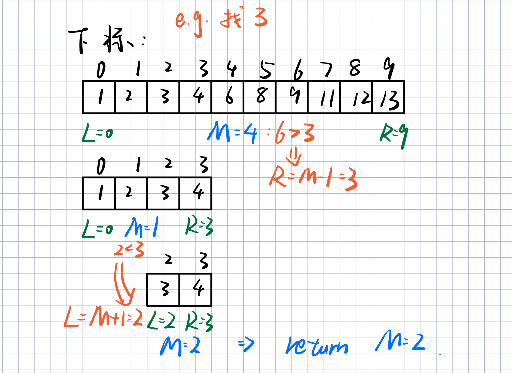
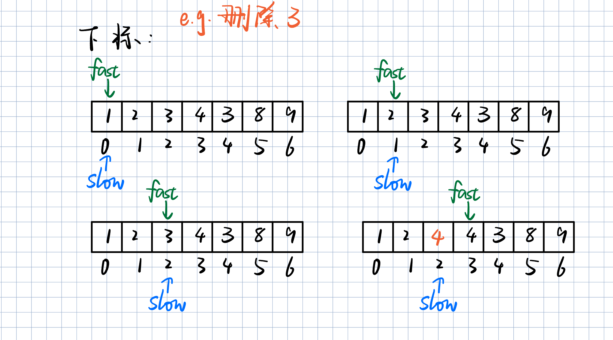
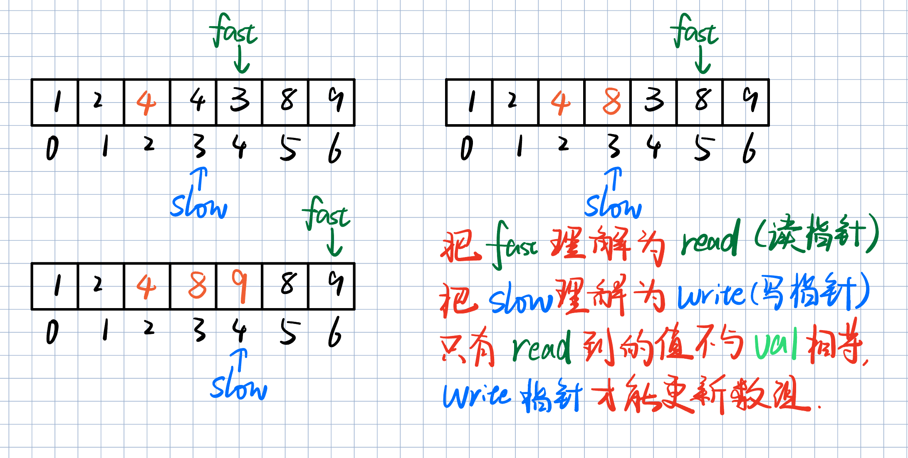
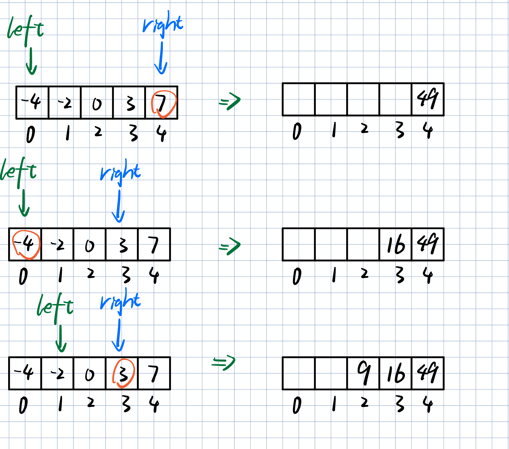
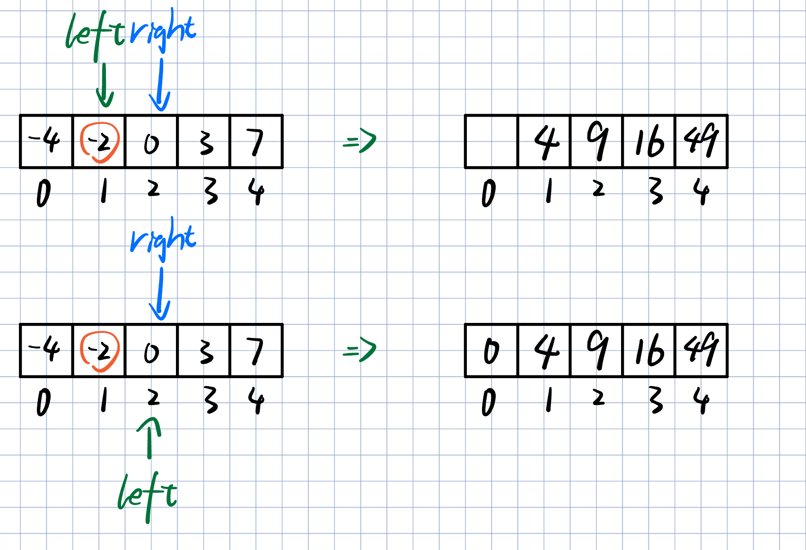
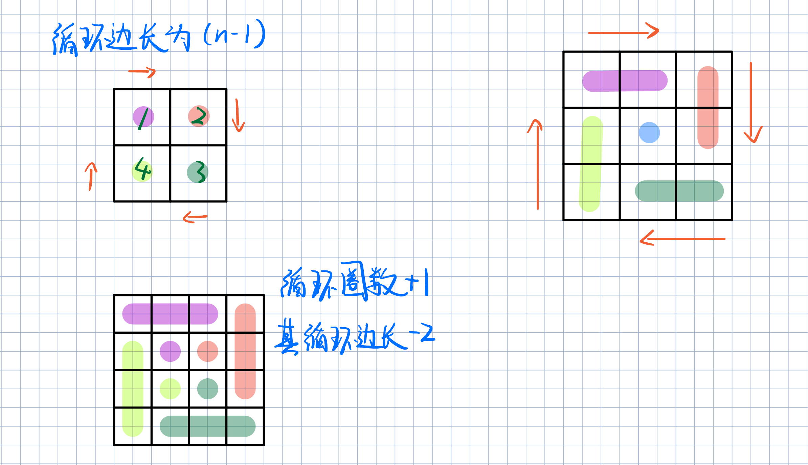
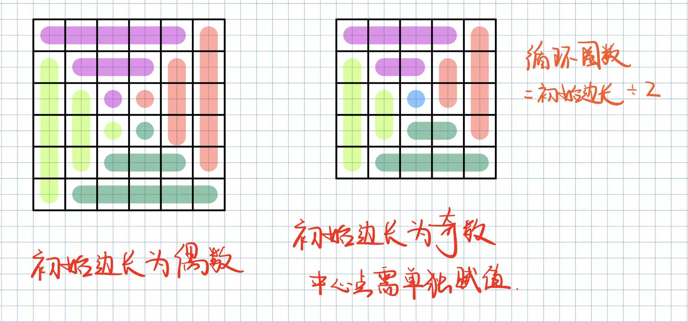

# LeetCode--代码随想录(数组)

## 704.二分查找

### 题目描述

给定一个 `n` 个元素有序的（升序）整型数组 `nums` 和一个目标值 `target` ，写一个函数搜索 `nums` 中的 `target`，如果 `target` 存在返回下标，否则返回 `-1`。

你必须编写一个具有 `O(log n)` 时间复杂度的算法。

**示例 1:**

```
输入: nums = [-1,0,3,5,9,12], target = 9
输出: 4
解释: 9 出现在 nums 中并且下标为 4
```

**示例 2:**

```
输入: nums = [-1,0,3,5,9,12], target = 2
输出: -1
解释: 2 不存在 nums 中因此返回 -1
```

 

**提示：**

1. 你可以假设 `nums` 中的所有元素是不重复的。
2. `n` 将在 `[1, 10000]`之间。
3. `nums` 的每个元素都将在 `[-9999, 9999]`之间。

### 解题思路

**这道题目的前提是数组为有序数组**，同时题目还强调**数组中无重复元素**，因为一旦有重复元素，使用二分查找法返回的元素下标可能不是唯一的，这些都是使用二分法的前提条件，当大家看到题目描述满足如上条件的时候，可要想一想是不是可以用二分法了。

二分查找涉及的很多的边界条件，逻辑比较简单，但就是写不好。例如到底是 `while(left < right)` 还是 `while(left <= right)`，到底是`right = middle`呢，还是要`right = middle - 1`呢？

大家写二分法经常写乱，主要是因为**对区间的定义没有想清楚，区间的定义就是不变量**。要在二分查找的过程中，保持不变量，就是在while寻找中每一次边界的处理都要坚持根据区间的定义来操作，这就是**循环不变量**规则。

写二分法，区间的定义一般为两种，左闭右闭即[left, right]，或者左闭右开即[left, right)。

我个人倾向使用左闭右闭方法处理二分法。

如图所示，当我们使用左闭右闭即`[left, right]`时，就需要让`right = middle - 1`了。因为`middle`的值已经做过一次比较。



### 代码

```java
class Solution {
    public int search(int[] nums, int target) {
        
        int length = nums.length;
        // 左边下标初始为0
        int left = 0;
        // 记录右边下标，为数组长度 - 1
        int right = length - 1;
        // 避免当 target 小于nums[0] nums[nums.length - 1]时多次循环运算
        if (target < nums[0] || target > nums[length - 1]) {
            return -1;
        }
        // 使用左闭右闭即[left, right]区间
        while(left <= right){
             // 初始化中点 middle，以防溢出，用减法
             int middle = left + (right - left) / 2;
            // 比target大，right = middle - 1
            if(nums[middle] > target){
                right = middle - 1;
            } else if(nums[middle] < target){
                // 比target小，left = middle + 1
                left = middle + 1;
            } else{
                return middle;
            }
        }
        // 若left > right，要求的target数组中不存在
        return -1;
        
    }
}
```


## 27.移除元素

### 题目描述

给你一个数组 `nums` 和一个值 `val`，你需要 **[原地](https://baike.baidu.com/item/原地算法)** 移除所有数值等于 `val` 的元素。元素的顺序可能发生改变。然后返回 `nums` 中与 `val` 不同的元素的数量。

假设 `nums` 中不等于 `val` 的元素数量为 `k`，要通过此题，您需要执行以下操作：

- 更改 `nums` 数组，使 `nums` 的前 `k` 个元素包含不等于 `val` 的元素。`nums` 的其余元素和 `nums` 的大小并不重要。
- 返回 `k`。

**用户评测：**

评测机将使用以下代码测试您的解决方案：

```
int[] nums = [...]; // 输入数组
int val = ...; // 要移除的值
int[] expectedNums = [...]; // 长度正确的预期答案。
                            // 它以不等于 val 的值排序。

int k = removeElement(nums, val); // 调用你的实现

assert k == expectedNums.length;
sort(nums, 0, k); // 排序 nums 的前 k 个元素
for (int i = 0; i < actualLength; i++) {
    assert nums[i] == expectedNums[i];
}
```

如果所有的断言都通过，你的解决方案将会 **通过**。

 

**示例 1：**

```
输入：nums = [3,2,2,3], val = 3
输出：2, nums = [2,2,_,_]
解释：你的函数应该返回 k = 2, 并且 nums 中的前两个元素均为 2。
你在返回的 k 个元素之外留下了什么并不重要（因此它们并不计入评测）。
```

**示例 2：**

```
输入：nums = [0,1,2,2,3,0,4,2], val = 2
输出：5, nums = [0,1,4,0,3,_,_,_]
解释：你的函数应该返回 k = 5，并且 nums 中的前五个元素为 0,0,1,3,4。
注意这五个元素可以任意顺序返回。
你在返回的 k 个元素之外留下了什么并不重要（因此它们并不计入评测）。
```

 

**提示：**

- `0 <= nums.length <= 100`
- `0 <= nums[i] <= 50`
- `0 <= val <= 100`

###  解题思路

双指针法（快慢指针法）： **通过一个快指针和慢指针在一个for循环下完成两个for循环的工作。**

定义快慢指针

- 快指针：寻找新数组的元素 ，新数组就是不含有目标元素的数组
- 慢指针：指向更新 新数组下标的位置

这里我们可以把快指针理解为`读指针（read）`，慢指针理解为`写指针（write）`；只有当`read`指针的值不与要删除的值`val`相等时，我们才更新`write`写指针，并移动写指针。

这样一来，写指针更新的次数，即为`新数组的大小`。





### 代码

```java
class Solution {
    public int removeElement(int[] nums, int val) {
        int write = 0;
        // 用read指针遍历数组nums
        for(int read = 0; read < nums.length; read++){
            // 只有当读指针所指向的值不等于val时，更新write指针
            if(val != nums[read]){
                nums[write++] = nums[read];
            }
        }
        // 写指针更新的次数，即为新数组的大小
        return write;
    }
}
```

## 977.有序数组的平方

### 题目描述

给你一个按 **非递减顺序** 排序的整数数组 `nums`，返回 **每个数字的平方** 组成的新数组，要求也按 **非递减顺序** 排序。

 

**示例 1：**

```
输入：nums = [-4,-1,0,3,10]
输出：[0,1,9,16,100]
解释：平方后，数组变为 [16,1,0,9,100]
排序后，数组变为 [0,1,9,16,100]
```

**示例 2：**

```
输入：nums = [-7,-3,2,3,11]
输出：[4,9,9,49,121]
```

 

**提示：**

- `1 <= nums.length <= 104`
- `-104 <= nums[i] <= 104`
- `nums` 已按 **非递减顺序** 排序

 

**进阶：**

- 请你设计时间复杂度为 `O(n)` 的算法解决本问题

### 解题思路

由于题目给定的数组是**非递减顺序**的数组；那么他们的数组首尾的值大小的平方（或者我们直接比较两头的**绝对值**），一定会是新数组里最大的值！

所以我们给定两个指针，左指针和右指针，让他们分别向中间靠拢。





### 代码

```java
class Solution {
    public int[] sortedSquares(int[] nums) {
        // 新建一个数组用于返回结果，其大小与原数组相同
        int[] result = new int[nums.length];
        // 定义左右指针下标
        int left = 0;
        int right = nums.length - 1;
        // 新数组从最右端开始存放最大平方值
        int index = right;
        while(left <= right){
            if(nums[left] * nums[left] > nums[right] * nums[right]){
                // 左边平方大，左指针右移
                result[index--] = nums[left] * nums[left];
                left++;
            } else{
                // 右边平方大，右指针左移
                // 最终left和right相等，right--后while条件失效
                result[index--] = nums[right] * nums[right];
                right--;
            }
        }
        return result;
    }
}
```

## 59.螺旋矩阵 II

### 题目描述

给你一个正整数 `n` ，生成一个包含 `1` 到 `n2` 所有元素，且元素按顺时针顺序螺旋排列的 `n x n` 正方形矩阵 `matrix` 。

 

**示例 1：**


```
输入：n = 3
输出：[[1,2,3],[8,9,4],[7,6,5]]
```

**示例 2：**

```
输入：n = 1
输出：[[1]]
```

 

**提示：**

- `1 <= n <= 20`

### 解题思路

这道题目可以说在面试中出现频率较高的题目，**本题并不涉及到什么算法，就是模拟过程，但却十分考察对代码的掌控能力。**

要如何画出这个螺旋排列的正方形矩阵呢？

求解本题依然是要坚持循环不变量原则。

模拟顺时针画矩阵的过程:

- 填充上行从左到右
- 填充右列从上到下
- 填充下行从右到左
- 填充左列从下到上

由外向内一圈一圈这么画下去。

这里一圈下来，我们要画每四条边，这四条边怎么画，每画一条边都要坚持一致的左闭右开，或者左开右闭的原则，这样这一圈才能按照统一的规则画下来。






### 代码

```java
class Solution {
    public int[][] generateMatrix(int n) {
        // 起始横坐标
        int startX = 0;
        // 起始纵坐标
        int startY = 0;
        // 初始要填的边长
        int initEdge = n-1;
        // 计算中心点
        int mid = n / 2;
        // 从数字1开始填
        int count = 1;
        // 循环圈数=n/2
        int loopCnt = n / 2;
        // 初始化结果矩阵
        int[][] result = new int[n][n];
        while(loopCnt-- > 0){
            int i=startX;
            int j=startY;

            // 从左到右，上行
            for(; j<initEdge + startY; j++){
                result[i][j] = count++;
            }
            // 从上到下，右列
            for(; i<initEdge + startX; i++){
                result[i][j] = count++;
            }
            // 从右到左，下行
            for(; j>startY; j--){
                result[i][j] = count++;
            }
            // 从下到上，左列
            for(; i>startX; i--){
                result[i][j] = count++;                
            }
            // 每循环一圈要填的边长-2
            initEdge-=2;
            startX++;
            startY++;
        }
        if(n % 2 == 1){
            result[mid][mid] = count;
        }
        return result;
    } 
}
```

