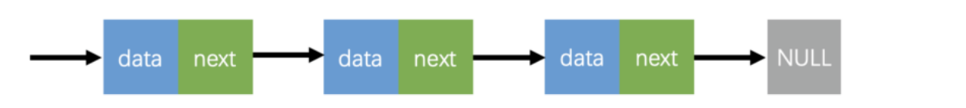
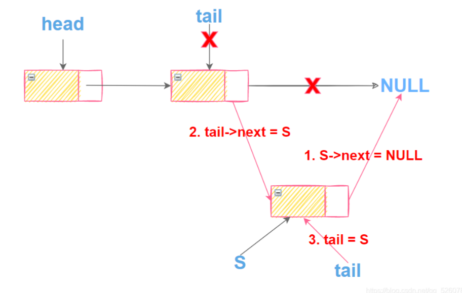
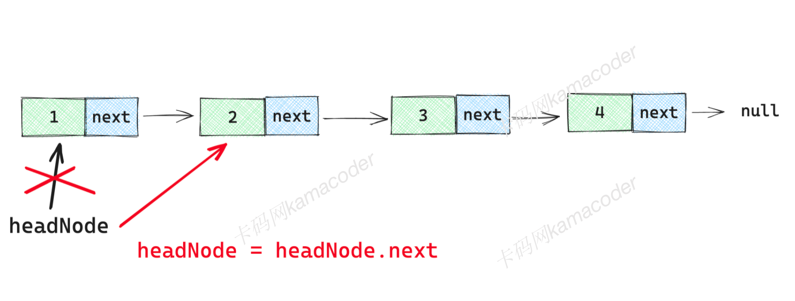
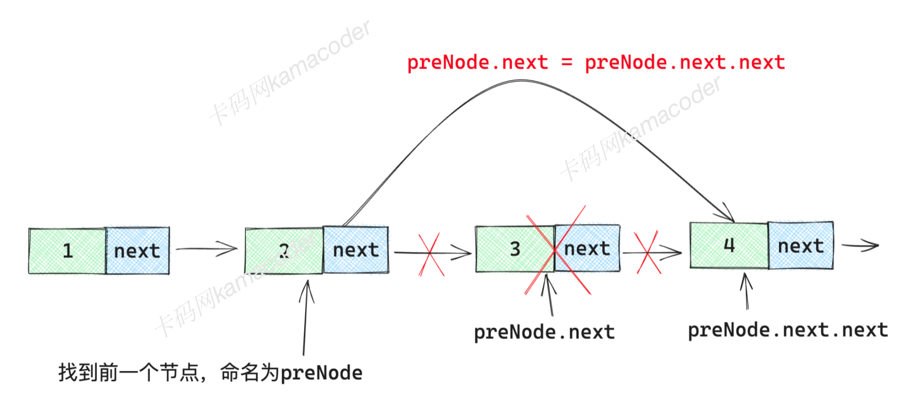

# OJ入门--Java基础篇

假设读者已经对于面向对象编程和数据结构有过基本的了解与入门，但是并不熟悉Java语言，本篇将对Java语言的OJ做题基础进行梳理。

## 1、A+B问题I

### 题目描述

你的任务是计算a+b。

###### 输入描述

输入包含一系列的a和b对，通过空格隔开。一对a和b占一行。

###### 输出描述

对于输入的每对a和b，你需要依次输出a、b的和。

如对于输入中的第二对a和b，在输出中它们的和应该也在第二行。

###### 输入示例

```
3 4
11 40
```

###### 输出示例

```
7
51
```

### 题记

#### 了解程序基本结构

我们一般使用代码编辑器来书写代码，书写时，我们会创建一个`.java`文件，比如`Main.java`, 而在任何一个Java程序中，都必须包括下面的基本结构：

```java
// 使用class关键字定义一个public(公开)类，类的名称是Main
public class Main {
    // Java程序总是从main方法开始执行，表示这是Java程序的入口
  public static void main(String[] args) {
    
  }
}
```

#### 输入输出

在Java中，你可以使用标准输入（`System.in`）进行输入操作，使用标准输出（`System.out`）来进行输出操作，此外还需要使用到 `Scanner` 类（Java标准库中的一个类）。

- `System.in` 是一个标准的输入流，它允许你从控制台（键盘）获取用户输入的数据。
- `Scanner` 是 Java 中的一个类，它位于 `java.util` 包中，它提供了一种简便的方式来处理输入数据。

```java
import java.util.Scanner;

public class Main {
    public static void main(String[] args) {
        Scanner sc = new Scanner(System.in);
        
        sc.close(); // 关闭Scanner对象
    }
}
```

在使用`Scanner`时，需要从Java的工具库`util`中引入，引入操作需要使用到`import`关键字

```java
// 引入Scanner
import java.util.Scanner;
```

因为有不同的数据类型，在实际应用中，你可以根据需要使用不同的 `Scanner` 方法来读取不同类型的数据。

- `next()`：读取下一个字符串。
- `nextInt()`：读取下一个整数。
- `nextDouble()`：读取下一个双精度浮点数。
- `nextLine()`：读取下一行文本。
- `hasNext()`：判断是否还有下一个输入项。如果有，返回 `true`；否则返回 `false`。
- `hasNextInt()`：判断是否还有下一个整数输入项。
- `hasNextDouble()`：检查是否还有下一个双精度浮点数输入项。

#### 题解

```java
import java.util.Scanner;
public class Main{
 
    public static void main(String args[]){
        Scanner sc = new Scanner(System.in);
        while(sc.hasNextInt()){
            int a = sc.nextInt();
            int b = sc.nextInt();
            System.out.println(a+b);
        }
        sc.close();
    }
 
}
```

#### 延伸

##### 包装类型

Java中有几种基本数据类型，但是基本数据类型本身不是对象，因此Java内部将这些基础数据类型用“类”的形式包装起来，形成“包装类”，这些包装类内部提供了很多的方法方便我们使用，并且可以执行与对象有关的操作，下面就是常见的基本数据类型和其对应的包装类。

- `Integer`: 包装`int`类型。
- `Long`: 包装`long`类型。
- `Short`: 包装`short`类型。
- `Byte`: 包装`byte`类型。
- `Double`: 包装`double`类型。
- `Float`: 包装`float`类型.
- `Character`: 包装`char`类型。
- `Boolean`: 包装`boolean`类型。

可以看到大多数包装类型只是将数据类型的首字母大写（类的首字母必须大写），可以简单理解包装类型就是在“基本数据”类型外面包装了一层，使其变成了对象，并在上面增加了一点功能而已。

##### 自动装箱和自动拆箱

而自动装箱和自动拆箱则是基本数据类型和对应的包装类型之间转换的一种应用，其实这个名称很形象，我们不是在“基本数据类型”上包装了一层形成“包装类”嘛，这个过程就叫自动装箱，而自动拆箱是把这个“包装”给拆掉，将包装类型对象转为对应的基本数据类型。

比如下面的示例：

```java
int age = 10; // 基本数据类型10
Integer boxedAge = age; // Integer boxedAge声明了一个包装对象，直接将10赋予这个对象，系统会帮我们将 10 装箱后放入到 boxedAge
```

同样的：`boxedAge`是一个`Integer`对象，而`age`是一个基本数据类型的`int`类型，可以直接赋值，系统会我们自动拆箱。

```java
Integer boxedAge = 10;
int age = boxedAge;
```

##### 数据类型转换

我们已经知道，`byte、short、int、long`等几种数据类型都是整数类型，只不过能表示的范围不同，就好像都是瓶子，只不过容量的大小有差距，就像小容量的瓶子里的水可以倒入大容量的瓶子一样，当容量小的数据类型的变量与容量大的数据类型的变量做运算时，结果自动提升为容量大的数据类型，这也被称之为**自动类型转换**。

```java
byte b = 10;
short s = b; //byte可以转为short类型
int i = b; // byte可以转为 int类型
long l = b; // byte可以转为 long类型
```

不过大容量的瓶子却无法将全部的水都倒入小容量的瓶子，如果非要倒入，就必须使用到**强制类型转换**。强制类型转换需要使用强制类型转换运算符（圆括号中包含目标数据类型）来明确指定数据类型转换，不过这种做法可能会是的数据丢失精度。

```java
int i = 100;
byte b = (byte)i; // 将 int类型的 i 转为 byte类型
System.out.println(b); //输出结果为100
```

##### 扩展：三元运算符

有的时候为了简化`if-else`这种操作，我们会使用到三元运算符。

先来看普通的`if-else`结构

```java
int a = 10;
int b = 20;
int c;
if (a > b) {
  c = a;
} else {
  c = b;
}
```

代码所表达的含义是，比较 a 和 b的值，如果 a 的值较大，则将 变量a 的值赋值为 c, 否则将 变量 b 的值赋值为 c

而三元运算符的结构如下：

```java
{expression} ? if-true-element : if-false-statement;
```

它会先求`expression`的值，如果为 true ,则取值 if-true-statement,否则取值 if-false-statement

还以上面的例子作为参考

```java
c = a > b ? a : b;
```

`a > b`是`expresssion`表达式， 如果这个表达式的判定结果是 true 的话，则取得`?`后面第一个值，即 a 的值，如果判断结果为 false 的话，则取得 `: `后面的值，即 b 的值。

## 2、A+B问题VIII

### 题目描述

你的任务是计算若干整数的和。

###### 输入描述

输入的第一行为一个整数N，接下来N行每行先输入一个整数M，然后在同一行内输入M个整数。

###### 输出描述

对于每组输入，输出M个数的和，每组输出之间输出一个空行。

###### 输入示例

```
3
4 1 2 3 4
5 1 2 3 4 5
3 1 2 3
```

###### 输出示例

```
10

15

6
```

###### 提示信息

注意以上样例为一组测试数据，后端判题会有很多组测试数据，也就是会有多个N的输入
例如输入可以是：

```java
3
4 1 2 3 4
5 1 2 3 4 5
3 1 2 3
3
4 1 2 3 4
5 1 2 3 4 5
3 1 2 3
```

输出则是

```java
10

15

6
10

15

6
```


只保证每组数据间是有空行的。但两组数据并没有空行。

### 题解

题目比较简单，直接上答案了。

```java
import java.util.Scanner;

public class Main{

    public static void main(String[] args){
        Scanner sc = new Scanner(System.in);
        while(sc.hasNext()){
            int rows = sc.nextInt();
            while (rows-- > 0){
                int nums = sc.nextInt();
                int sum = 0;
                while (nums-- > 0){
                    sum += sc.nextInt();
                }
                System.out.println(sum);
                if(rows > 0){
                    System.out.println();
                }
            }
        }
        sc.close();
    }

}
```

## 3、数组的倒序与隔位输出

### 题目描述

给定一个整数数组，编写一个程序实现以下功能：

1. 将输入的整数数组倒序输出，每个数之间用空格分隔。
2. 从正序数组中，每隔一个单位（即索引为奇数的元素），输出其值，同样用空格分隔。

###### 输入描述

第一行包含一个整数 n，表示数组的长度。
接下来一行包含 n 个整数，表示数组的元素。

###### 输出描述

首先输出倒序排列的数组元素，然后输出正序数组中每隔一个单位的元素。

###### 输入示例

```
5
2 3 4 5 6
```

###### 输出示例

```
6 5 4 3 2
2 4 6
```

###### 提示信息

```java
数据范围：
1 <= n <= 1000.
```

### 题记

#### 数组

Java中的数组可以使用不同的方式进行初始化，包括动态初始化和静态初始化。

在声明数组后，使用 `new` 关键字来分配内存并初始化数组元素。

```java
int[] numbers = new int[3]; // 动态初始化一个包含3个整数的数组
```

**静态初始化**：在声明数组时，同时为数组分配内存并指定初始值

```java
int[] numbers = {1, 2, 3}; // 静态初始化一个包含初始值的整数数组
```

访问数组中的元素，您可以使用下标操作符 `[]`，请注意，下标从0开始，直到数组长度的前一位。

```java
int value = arr[2]; // 获取数组 arr 的第三个元素的值，即 3
```

除了访问元素，还可以通过下标操作符 `[]` 修改数组中的元素的值。

```java
arr[0] = 100;  // 修改数组 arr 的第一个元素的值为 100
```

所有的数组都拥有一个属性 `length`， 用于获取数组的长度，表示数组中元素的数量。例如：

```java
int[] nums = {1, 2, 3};
int length = nums.length; // 获取数组的长度（值为3）
```

> ⚠️ 当数组越界时，Java会抛出运行时错误(异常)

```java
int[] numbers = {1, 2, 3, 4, 5};
for (int i = 0; i < numbers.length; i++) {
    System.out.println(numbers[i]);
}
```

以上，我们通过一些简短的代码知道了数组的定义、特点、声明方式、访问方式和遍历方式，以及数组使用中容易出错的地方。

#### ArrayList

数组的长度是固定的，但是我们往往并不知道一组数据的大小，这个时候直接使用数组并不太满足需求，可以考虑使用`ArrayList`。在Java中，`ArrayList` 是 `java.util` 包中的一个类，可以在运行时对其动态添加和删除元素以满足我们的操作需要。

使用前需要在代码中导入 `ArrayList` 类，如下所示：

```java
import java.util.ArrayList;
```

您可以通过以下方式创建一个 `ArrayList`：

> 集合类只能存储对象而不是原始数据类型。

```java
ArrayList<Integer> nums = new ArrayList<Integer>();
```

想要为 `ArrayList` 添加元素，需要使用`add`方法

```java
nums.add(10);
nums.add(100);
nums.add(1000);
```

想要获取 `ArrayList` 中的元素，需要使用 `get` 方法，和`[]`类似，索引从0开始

```java
int firstNumber = nums.get(0); // 获取第一个元素 1
```

使用 `remove(index)` 方法来删除 `ArrayList` 中的对应索引的元素。

```java
nums.remove(1); // 删除第二个元素
```

不同于数组使用`length`, `ArrayList` 使用 `size` 方法来获取 中的元素数量。

```java
int size = nums.size(); // 获取 ArrayList 的大小
```

在数组中，我们通过`for循环`完成了对数组的遍历，`ArrayList` 遍历的方式是一样的。

```java
for (int i = 0; i < nums.size(); i++) {
       System.out.println(nums.get(i));
}
for (Integer num : nums) {
    System.out.println(num);
}
```

#### 增强for循环

除了普通的for循环遍历，你还可以使用增强型 `for` 循环或来遍历 `ArrayList` 中的元素，结构如下，这种方式更为简洁和易读，基本语法如下：

```java
for (elementType element : collection) {
    // 在此处处理 element
}
```

- `elementType` 是元素的数据类型
- `element` 是在每次迭代中表示一个元素的变量
- `collection` 是要迭代的数组或其他的对象（比如后面讲到的集合）

```java
for (String name : names) {
    System.out.println(name);
}
```

#### 题解

```java
import java.util.Scanner;
 
public class Main{
 
    public static void main(String[] args){
        Scanner sc = new Scanner(System.in);
        while(sc.hasNext()){
            int n = sc.nextInt();
            int[] arrays = new int[n];
            // 初始化数组元素
            for(int i=0; i<n; i++){
                arrays[i] = sc.nextInt();
            }
            // 倒序打印数组
            for(int i=n-1; i>=0; i--){
                if( i != 0 ){
                System.out.print(arrays[i]);
                System.out.print(" ");
                } else{
                    System.out.println(arrays[i]);
                }
                 
            }
 			// 隔位打印数组
            for(int i=0; i<n; i++){
                if( i % 2 == 0 && i!= n-1 ){
                System.out.print(arrays[i]);
                System.out.print(" ");
                } else if (i % 2 == 0 && i== n-1)
                {
                System.out.print(arrays[i]);
                }
            }
 
        }
        sc.close();
    }
 
}
```

## 4、摆平积木

### 题目描述

小明很喜欢玩积木。一天，他把许多积木块组成了好多高度不同的堆，每一堆都是一个摞一个的形式。然而此时，他又想把这些积木堆变成高度相同的。但是他很懒，他想移动最少的积木块来实现这一目标，你能帮助他吗？


###### 输入描述

```
输入包含多组测试样例。每组测试样例包含一个正整数n，表示小明已经堆好的积木堆的个数。
接着下一行是n个正整数，表示每一个积木堆的高度h，每块积木高度为1。其中1<=n<=50,1<=h<=100。
测试数据保证积木总数能被积木堆数整除。
当n=0时，输入结束。
```

###### 输出描述

对于每一组数据，输出将积木堆变成相同高度需要移动的最少积木块的数量。
在每组输出结果的下面都输出一个空行。

###### 输入示例

```
6
5 2 4 1 7 5
0
```

###### 输出示例

```
5
```

### 题记

题目要求我们把n堆高度不同的积木分成n堆高度相同的积木，假设我们面前真的有这样一堆积木，应该怎么做才能划分均等呢？

要想实现题目的要求，需要下面两步操作：

- 第一步：我们需要数清每一摞积木的数量，把他们的总数相加，这样我们就知道积木的总数量，再把得到的结果除以n, 就得到了在高度相同的情况下，每一摞积木的块数。
- 第二步：对于超过平均值的积木，计算当前的积木数量和平均值的差值，把多的积木数量移到缺少的部分，直到积木高度相同。

#### 题解

```java
import java.util.Scanner;

public class Main{

    public static void main(String[] args){
        Scanner sc = new Scanner(System.in);
        while(sc.hasNext()){
           int nums = sc.nextInt();
            // 如果木堆数量为0，则结束该次循环
            if(nums==0){
            continue;
           }
           int[] arrays = new int[nums];
           int sum = 0;
           for(int i=0; i<nums; i++){
            arrays[i] = sc.nextInt();
            sum += arrays[i];
           }
            // 计算出最终的平均高度
           int avg = sum / nums;
           int count = 0;
           for(int i=0; i<nums; i++){
               // 将过高的木堆一个个削平
            while(arrays[i] > avg){
                arrays[i]--;
                count++;
            }
           }
            System.out.println(count);
            System.out.println();

        }
        sc.close();
    }

}
```

## 5、奇怪的信

### 题目描述

有一天, 小明收到一张奇怪的信, 信上要小明计算出给定数各个位上数字为偶数的和。
例如：5548，结果为12，等于 4 + 8 。
小明很苦恼，想请你帮忙解决这个问题。

###### 输入描述

输入数据有多组。每组占一行，只有一个整整数，保证数字在32位整型范围内。

###### 输出描述

对于每组输入数据，输出一行，每组数据下方有一个空行。

###### 输入示例

```
415326
3262
```

###### 输出示例

```
12

10

```

### 题解

```java
import java.util.Scanner;

public class Main{

    public static void main(String[] args){
        Scanner sc = new Scanner(System.in);
        while(sc.hasNext()){
            int num = sc.nextInt();
            int sum = 0;
            while(num > 0){
                int digit = num % 10;
                if(digit % 2 == 0){
                    sum += digit;
                }
                // 注意，小于10的数字/10
                // 例如，2/10=0
                num /= 10;
            }
            System.out.println(sum);
            System.out.println();
        }
        sc.close();
    }

}
```

## 6、平均绩点

### 题目描述

每门课的成绩分为A、B、C、D、F五个等级，为了计算平均绩点，规定A、B、C、D、F分别代表4分、3分、2分、1分、0分。

###### 输入描述

有多组测试样例。每组输入数据占一行，由一个或多个大写字母组成，字母之间由空格分隔。

###### 输出描述

每组输出结果占一行。如果输入的大写字母都在集合｛A,B,C,D,F｝中，则输出对应的平均绩点，结果保留两位小数。否则，输出“Unknown”。

###### 输入示例

```
A B C D F
B F F C C A
D C E F
```

###### 输出示例

```
2.00
1.83
Unknown
```

### 题记

#### String的使用

1. 声明和初始化

可以通过多种方式来声明和初始化`string`变量，下面是比较常用的几种方式：

在 Java 中，你可以使用双引号直接创建字符串字面值( 字符串文字）来初始化字符串变量。

```java
String name = "Hello, Java";
```

还可以使用`new`的方式来创建一个字符串对象。

```java
String message = new String("Hello");
```

1. 字符串操作

和数组类似，字符串也提供了一系列对字符串的操作方法，常见的有以下几种:

- 字符串拼接

Java 支持使用 `+` 运算符来连接字符串，返回字符串连接之后的结果

> 在Java中，`String`类的对象是不可变的，所以每次字符串拼接都会创建一个新的字符串对象

```java
string s1 = "hello";
string s2 = "world";
string s3 = s1 + " " + s2; // 对字符串进行连接，拼接之后的字符串是"hello world", 中间加了空格
```

- 字符串长度

使用 `length()` 方法来获取字符串的长度

```java
int len = s1.length(); // 字符串的长度即字符串中字符的个数，"hello"的长度为5
```

- 字符串比较

使用 `equals()` 方法来比较两个字符串的内容是否相等

- 字符串索引

字符串中的字符可以通过索引访问，索引从 0 开始。

```java
char c1 = s1.charAt(0);
```

- 字符串切割和拆分：

可以使用 `split()` 方法将一个字符串根据指定的分隔符拆分成字符串数组。

```java
String[] parts = s3.split(" ") // 会将字符串根据空格拆分为多个部分
```

- 字符串格式化：

Java 提供了多种方式来格式化字符串，例如，使用 `String.format()` 方法或 `printf()` 方法。

- 字符串查找和替换：

可以使用 `indexOf()` 方法来查找字符串中某个子串的位置，还可以使用 `replace()` 方法来替换字符串中的部分内容。

在Java中，想要读取下一行字符串可以使用`nextLine()` 方法， 这个方法会等待用户输入一行文本，并将整行文本作为字符串返回。

```java
import java.util.Scanner;

public class Main {
    public static void main(String[] args) {
        // 创建一个 Scanner 对象，并将标准输入（键盘输入）作为输入源
        Scanner scanner = new Scanner(System.in);

        // 使用 nextLine() 方法读取下一行字符串，并将其存储在变量中
        String inputLine = scanner.nextLine();

        // 关闭 Scanner 对象，释放资源
        scanner.close();
    }
}
```

#### 格式输出

Java提供了类似C语言的`printf`函数用于格式化输出, 你可以将表达式`args`以特点的格式`format`处理后输出到控制台。语法格式如下：

> 此外，你还可以使用format()方法，它和printf()方法是等价的，都只需要一个格式化字符串，后面跟着参数，其中每个参数都对应一个格式说明符。

```java
System.out.printf(format, args);
```

其中`format`是一个字符串，用于指定输出的格式，`args`是一个参数列表，包含了要插入到格式字符串中的值。常见的格式符号有`%d(用于输出整数)`, `%f(用于输出浮点数)`,`%s(用于输出字符串)`, `%n(用于输出换行符)`

比如想要输出一个整数，`format`部分要使用`%d`, `args`就是插入到格式符号部分的数值。

```java
int num = 42;
System.out.printf("%d", num);
```

想要在Java中输出保留两位小数的数字，可以使用`%.2f` 这种格式

```java
double number = 3.14159265359;
// 使用printf进行格式化输出，只保留两位小数
printf("%.2f\n", number);
```

#### 扩展：Switch-Case

其实除了`if-else`之外，还有一种语句可以根据表达式的值执行不同的代码块。`switch` 语句将表达式的值与一系列可能的值进行比较，并根据匹配的情况执行相应的代码块，它的基本结构如下：

```java
switch (expression) {
    case value1:
        // 与 value1 匹配时执行的代码
        break;
    case value2:
        // 与 value2 匹配时执行的代码
        break;
    // 可以有多个 case 分支
    default:
        // 如果没有匹配的 case 分支，执行 default 分支
}
```

`switch-case`是将`switch`里面的表达式与`case`一一作比对，如果符合时，则执行对应的代码，`break` 语句用于终止 `switch` 语句的执行。如果没有 `break`，程序将会继续执行后续的 `case` 分支，直到遇到 `break` 或结束 。而`default` 用于处理没有匹配的情况，如果没有匹配的 `case` 分支，将执行 `default` 分支，相当于`if-else`语句中的`else`。

> `case` 中不能使用变量，而不是一个确定的值

#### 题解

```java
import java.util.Scanner;

public class Main{
    
    public static void main(String[] args){
        Scanner sc = new Scanner(System.in);
        while(sc.hasNext()){
            String line = sc.nextLine();
            String[] chars = line.split(" ");
            float sum = 0f;
            // 如果有异常输入，则输出Unknown
            boolean flag = false;
            // 因为这里是String[],所以是.length,而不是.length()
            for(int i=0; i<chars.length; i++){
                switch(chars[i]){
                    case "A":
                    sum += 4;
                    break;
                    case "B":
                    sum += 3;
                    break;
                    case "C":
                    sum += 2;
                    break;
                    case "D":
                    sum += 1;
                    break;
                    case "F":
                    sum += 0;
                    break;
                    default:
                    flag = true;
                    break;
                }
            }
            if(!flag){
                float avg = sum / chars.length;
                System.out.printf("%.2f",avg);
                System.out.println();
            } else{
                System.out.println("Unknown");
            }
        }
        sc.close();
    }

}
```

## 7、句子缩写

### 题目描述

输出一个词组中每个单词的首字母的大写组合。

###### 输入描述

输入的第一行是一个整数n，表示一共有n组测试数据。（输入只有一个n，没有多组n的输入）
接下来有n行，每组测试数据占一行，每行有一个词组，每个词组由一个或多个单词组成；每组的单词个数不超过10个，每个单词有一个或多个大写或小写字母组成；
单词长度不超过10，由一个或多个空格分隔这些单词。

###### 输出描述

请为每组测试数据输出规定的缩写，每组输出占一行。

###### 输入示例

```
1
ad dfa     fgs
```

###### 输出示例

```
ADF
```

###### 提示信息

注意：单词之间可能有多个空格

### 题记

#### 字符大小的比较

字符串是由一个个字符组合而成的, 比如字符串`"hello"`, 是由字符(`char`)类型`'h'、'e'、'l'、'l'、'o'`组成的，我们可以通过`charAt(index)`方法来访问每一个字符。

那字符之间是否有大于、小于的比较呢？换而言之，字符是否有大小呢？

实际上是可以的，每个字符都有一个唯一的 ASCII 编码值，表示它在 ASCII 字符集中的位置。在比较字符大小时，实际上是比较它们的 ASCII 编码值，比如小写字母 `a` 的 ASCII 编码值是 97, 小写字母`b`的 ASCII 编码值是98。大写字母 A 的ASCII编码值是 65， 大写字母 B 的ASCII编码值是 66， 大小写字母之间的差值是32。正是因为所有大小些字母之间的差值都是 32， 所以我们可以通过将大写字母的ASCII码值加上32来得到对应的小写字母的ASCII码值。

```java
char uppercaseChar = 'A';
char lowercaseChar = (char) (uppercaseChar + 32); // 将大写字符的值 加上32，得到对应的小写字母，并使用强制类型转换 来确保结果是字符类型。
```

此外，你还可以使用一些内置的方法进行字符之间的转换(并且这是推荐的做法)，常用的主要有以下两个：

- `toUpperCase()`: 将小写字母转换成大写形式
- `toLowerCase()`: 将大写字母转换成小写形式

```java
char a = 'a'; // 小写字符 'a'
char uppercaseChar = Character.toUpperCase(a); // 大写字符 'A'
char lowercaseChar = Character.toLowerCase('A'); // 将 大写字符 'A' 转换为小写字符
```

> 除了ASCII码以外，你还可能经常见到 Unicode 码，这两者之间有什么区别嘛？

- ASCII码是一个比较早的、简单的字符编码标准，仅仅包含128个不同的字符，主要是一些基本的拉丁字母、数字、标点符号和回车、换行等，每个字符都有一个唯一的整数数值与之对应。
- 而 Unicode 码是一个更为广泛的字符编码标准，它包含了世界上几乎所有已知的字符、符号和文字，常见的Unicode编码包括UTF-8、UTF-16和UTF-32，它们使用不同数量的字节来表示字符。

总结来说，就是ASCII码表示的字符比较少，只包含一些常用的字符，而Unicode包含几乎所有语言的字符。

#### StringBuilder和String的区别

`StringBuilder` 也用于处理字符串，但为什么要使用`StringBuilder`而不是String?

这是因为如果你使用 `String` 进行字符串拼接，每次拼接都会创建一个新的字符串对象，这会产生大量的临时对象，会影响性能。而使用 `StringBuilder` 可以避免这个问题，`StringBuilder` 是可变的，它允许你在不创建新的字符串对象的情况下进行字符串的连接和修改，不会创建大量的临时对象，因此更高效。

#### 题解

```java
import java.util.*;

public class Main{
    
    public static void main(String[] args){
        Scanner sc = new Scanner(System.in);
        while(sc.hasNext()){
            int line = sc.nextInt();
            sc.nextLine();
            while(line-- > 0){
                // trim() 除去首尾空格
                String stringLine = sc.nextLine().trim();
                char[] chars = stringLine.toCharArray();
                StringBuilder sb = new StringBuilder();
                
                int j = 0;
                while(j<chars.length){
                    sb.append(Character.toUpperCase(chars[j++]));
                    // 跳过非空格字符
                    while(j<chars.length && chars[j] != ' '){
                        j++;
                    }
                    // 跳过空格字符
                    while(j<chars.length && chars[j] == ' '){
                        j++;
                    }
                }
                System.out.println(sb.toString());
            }

        }
        sc.close();
    }

}
```

## 8、链表的基础操作I

### 题目描述

构建一个单向链表，链表中包含一组整数数据。输出链表中的所有元素。

要求：

1. 使用自定义的链表数据结构
2. 提供一个 `LinkedList `类来管理链表，包含**构建链表**和**输出链表元素**的方法
3. 在 main 函数中，创建一个包含一组整数数据的链表，然后调用链表的输出方法将所有元素打印出来

###### 输入描述

包含多组测试数据，输入直到文件尾结束。 

每组的第一行包含一个整数 n，表示需要构建的链表的长度。 

接下来一行包含 n 个整数，表示链表中的元素。

###### 输出描述

每组测试数据输出占一行。
按照顺序打印出链表中的元素，每个元素后面跟一个空格。

###### 输入示例

```
5
1 2 3 4 5
6
3 4 5 6 7 8
```

###### 输出示例

```
1 2 3 4 5
3 4 5 6 7 8
```

###### 提示信息

数据范围：

1 <= n <= 1000;

### 题记

#### 链表

与数组不同，链表的**元素在计算机中的存储可以是连续的，也可以是不连续的**，每个数据元素（称之为节点）除了存储本身的信息（`data数据`）之外，还存储一个指示着下一个元素的地址信息（`next指针`），给人的感受就好像这些元素是通过一条“链”串起来的。



链表的第一个节点的存储位置被称为**头节点**，然后通过`next`指针找到下一个节点，直到找到最后一个节点，最后一个节点的`next`指针并不存在，也就是“空”的，在Java中，用`null`来表示。

#### 构造方法

我们需要在类中实现构造方法，那构造方法该如何定义呢。

- 构造方法的名称必须与所属类的名称完全相同。
- 构造方法没有返回类型

```java
class Person {
  string name;
  int age;
  // 构造方法，接受name和age参数
  public Person(String name, int age) {
    this.name = name;
    this.age = age;
  }
}
```

上面的`this`是一个关键字，表示当前示例，就是为当前示例的`name`和`age`赋值为传递的`nage`和`age`的意思。

#### 定义链表和链表节点

在Java中，你可以使用类来定义一个链表节点，由链表节点的概念我们可以知道，一个链表节点包含一个数据元素和一个指向下一个节点的引用，即包括一个数据字段和一个节点字段。

根据之前学习的类和构造方法的知识，我们可以写出链表节点的定义方式。

```java
class Node {
    int data; // 数据元素
    Node next; // 指向下一个节点的引用next, 类型是Node, 实例名称为next
  // 构造方法，初始化节点对象，参数为一个整数,表示节点的data字段
    public Node(int data) {
        this.data = data; // 初始化节点的data字段
        this.next = null; // next字段初始化为null，表示新创建的节点没有下一个节点
    }
}
```

上面的代码只是声明一个链表节点，我们还需要定义一个链表类，链表类应该包括链表头节点和链表的节点数量这两个字段。

```java
class LinkedList {
   // 私有变量，存储链表头节点
    private Node headNode;
   // 私有变量，存储链表长度
    private int length;
      // 链表类的构造方法，用于初始化链表对象
    public LinkedList() {
      // 构造链表时，头节点为null, 表示链表开始时是空的
        this.headNode = null;
      // 没有初始化 length, 使用默认值 0，表示链表长度为0
        this.length = 0;
    }
}
```

在Java中，一个类可以包含另一个类（内部类），内部类可以访问外部类的私有成员，将相关的类放在一起可以使代码更具结构性和可读性。下面的代码就将`Node`类放在`LinkList`类中，表明`Node` 类是 `LinkList` 类的一部分。

```java
class LinkedList {
      // 内部类，定义链表节点，同时它是public的，可以被外部类和其他类使用。
    public static class Node {
        int data;
        Node next;
        public Node(int data) {
            this.data = data;
            this.next = null;
        }
    }
 
    private Node headNode;
    private int length;
 
    public LinkedList() {
        this.headNode = null;
        this.length = 0;
    }
}
```

#### 链表的打印和插入操作

上面我们完成了定义链表和链表节点的操作，但是这个链表并没有提供对应的方法使我们将一个节点插入到链表中，从而形成一个完整的链表。

接下来，我们就定义一个方法，接收传入的数据，并构建一个新的节点，插入到链表的尾部，具体步骤如下：

- 链表长度`length` + 1
- 创建一个新的链表节点，初始化它的值为`data`
- 如果当前链表为空链表（头节点为空），则新创建的链表节点为头节点
- 如果当前链表不为空链表，将新的节点放入到链表的尾部，接入链表，也就是当前链表的尾部的`next`指向新节点，新接入的链表节点变为链表的尾部

```java
// 该方法为public方法，能够被其他类使用，接收一个整数作为数据
public Node insert(int data) {
    this.length++; // 链表长度 加 1
}
```

使用`new`定义一个链表节点实例

```java
Node newNode = new Node(data); // 定义一个新节点
```

接下来需要将新节点插入到链表尾部，但是需要面临两种情况(这是因为需要处理头节点)，链表为空（判定条件为头节点为空或是链表长度为0）和链表不为空的情况

```java
if (this.headNode == null) { // 链表为空
 
} else { // 链表不为空
  
}
```

当为空链表时，只需让新添加的节点成为链表的头节点即可。

```java
 // 新创建的节点成为头节点
this.headNode = newNode; 
```

当链表不为空时，需要找到链表的最后一个节点，将最后一个节点的`next`指向新添加的节点，但是如果找到最后一个节点呢？

这是一个固定模板操作，从头节点开始遍历，直到找到某个节点的`next`指向`null`时，说明已经走到了链表的尾部。

或者我们可以这样理解，有一份情报需要从上往下传递，接头人逐级传递，直到找不到下一级接头人时，说明情报已经传达到了尾部。

假设我们用`currentNode`指代当前已经传递到了那个节点，最初需要将其指向头节点。

```java
Node currentNode = this.headNode; // currentNode指针指向 头节点
while (currentNode.next != null) {
   // 不断移动currentNode，直到 next指针为空时停止，说明已经走到最后一个节点
    currentNode = currentNode.next;  // currentNode 移动到下一个节点
}
```

此时`currentNode`已经指向最后一个节点，之后将新创建的节点插入到链表的尾部，只需将最后一个节点的`next`指针指向新插入的节点即可。

```java
currentNode.next = newNode; // 将新创建的节点插入到链表的尾部
```



完整代码如下：

```java
public Node insert(int data) {
    this.length++; // 链表长度 加 1
    Node newNode = new Node(data); // 创建一个新的链表节点，初始化值为data
    if (this.headNode == null) { // 如果当前链表为空链表 
        this.headNode = newNode; // 新创建的链表节点为头节点
    } else { // 如果当前链表不是空链表
        Node currentNode = this.headNode; // currentNode指针初始指向 头节点
        while (currentNode.next != null) {
           // 不断移动currentNode，直到 next指针为空时停止，说明已经走到最后一个节点
            currentNode = currentNode.next; 
        }
        currentNode.next = newNode; // 将新创建的节点插入到链表的尾部
    }
    return newNode; // 返回插入的节点
}
```

如果想要打印链表节点，操作步骤和遍历链表直到找到最后一个节点的过程相似。

```java
// 打印链表
public void printLinkedList() {
    Node currentNode = headNode; // currentNode指针初始指向 头节点
    while (currentNode != null) {
        System.out.println(currentNode.data); // 输出链表数据
        currentNode = currentNode.next; // 移动 currentNode
    }
}
```

#### 题解

```java
import java.util.Scanner;

// 不写public是包级私有类，同包可以访问该类
class LinkedList{

    // 头节点
    private Node headNode;
    private int length;

    // 静态内部类：Node 是 LinkedList 的"成员"，但逻辑上是独立类型
    public static class Node{
        int data;
        Node next;

        public Node(int data){
            this.data = data;
            this.next = null;
        }
    }

    public LinkedList(){
        this.headNode = null;
        this.length = 0;
    }

    // 插入数据
    public void insert(int data){
        Node node = new Node(data);
        length++;
        if(headNode == null){
            headNode = node;
        } else{
            Node currentNode = headNode;
            while(currentNode.next != null){
                currentNode = currentNode.next;
            }
            currentNode.next = node;
        }
    }

    // 输出数据
    public void printLinkedList(){
            Node currentNode = headNode;
            while(currentNode.next != null){
                System.out.print(currentNode.data);
                System.out.print(" ");
                currentNode = currentNode.next;
            }
            System.out.println(currentNode.data);
    }

}

public class Main{
    
    public static void main(String[] args){
        Scanner sc = new Scanner(System.in);
        while(sc.hasNext()){
            int num = sc.nextInt();
            LinkedList list = new LinkedList();
            for(int i=0; i<num; i++){
                list.insert(sc.nextInt());
            }
            list.printLinkedList();
        }
        sc.close();
    }

}
```

## 9、链表的基础操作II

### 题目描述

请编写一个程序，实现以下操作： 

构建一个单向链表，链表中包含一组整数数据，输出链表中的第 m 个元素（m 从 1 开始计数）。 

要求：

1. 使用自定义的链表数据结构
2. 提供一个 linkedList 类来管理链表，包含构建链表、输出链表元素以及输出第 m 个元素的方法
3. 在 main 函数中，创建一个包含一组整数数据的链表，然后输入 m，调用链表的方法输出第 m 个元素

###### 输入描述

第一行包含两个整数 n 和 k，n 表示需要构建的链表的长度，k 代表输入的 m 的个数。 

接下来一行包含 n 个整数，表示链表中的元素。 

接下来一行包含 k 个整数，表示输出链表中的第 m 个元素。

###### 输出描述

测试数据输出占 k 行。 

每行输出链表中的第 m 个元素。如果 m 位置不合法，则输出“Output position out of bounds.”。

###### 输入示例

```
5 5
1 2 3 4 5
4 3 2 9 0
```

###### 输出示例

```
4
3
2
Output position out of bounds.
Output position out of bounds.
```

### 题解

题目比较简单，我给的一种写法：

```java
import java.util.Scanner;

class LinkedList{

    public static class Node{
        int data;
        Node next;

        public Node(int data){
            this.data = data;
            this.next = null;
        }
    }

    private Node headNode;
    private int length;

    public LinkedList(){
        this.headNode = null;
        this.length = 0;
    }

    // 插入节点
    public void insert(int data){
        Node node = new Node(data);
        length++;
        if(headNode == null){
            headNode = node;
        } else{
            Node currentNode = headNode;
            while(currentNode.next != null){
                currentNode = currentNode.next;
            }
            currentNode.next = node;
        }
    }

    // 查找第 n 个元素并打印
    public void printAt(int pos){
        if(pos > length || pos < 1){
            System.out.println("Output position out of bounds.");
        } else{
            Node currentNode = headNode;
            int count = 1;
            while(count < pos){
                currentNode = currentNode.next;
                count++;
            }
            System.out.println(currentNode.data);
        }

    }

}

public class Main{
    
    public static void main(String[] args){
        Scanner sc = new Scanner(System.in);
        while(sc.hasNext()){
            int n = sc.nextInt();
            int k = sc.nextInt();
            LinkedList list = new LinkedList();
            for(int i = 0; i<n; i++){
                list.insert(sc.nextInt());
            }
            for(int i = 0; i<k; i++){
                list.printAt(sc.nextInt());
            }
        }
        sc.close();
    }

}
```

## 10、链表的基础操作III

### 题目描述

请编写一个程序，实现以下链表操作：构建一个单向链表，链表中包含一组整数数据。

1. 实现在链表的第 n 个位置插入一个元素，输出整个链表的所有元素。
2. 实现删除链表的第 m 个位置的元素，输出整个链表的所有元素。

要求：

1. 使用自定义的链表数据结构。
2. 提供一个 linkedList 类来管理链表，包含构建链表、插入元素、删除元素和输出链表元素的方法。
3. 在 main 函数中，创建一个包含一组整数数据的链表，然后根据输入的 n 和 m，调用链表的方法插入和删除元素，并输出整个链表的所有元素。

###### 输入描述

每次输出只有一组测试数据。

每组的第一行包含一个整数 k，表示需要构建的链表的长度。

第二行包含 k 个整数，表示链表中的元素。

第三行包含一个整数 S，表示后续会有 S 行输入，每行两个整数，第一个整数为 n，第二个整数为 x ，代表在链表的第 n 个位置插入 x。

S 行输入...

在 S 行输入后，后续会输入一个整数 L，表示后续会有 L 行输入，每行一个整数 m，代表删除链表中的第 m 个元素。

L 行输入...

###### 输出描述

包含多组输出。

每组第一行输出构建的链表，链表元素中用空格隔开，最后一个元素后没有空格。

然后是 S 行输出，每次插入一个元素之后都将链表输出一次，元素之间用空格隔开，最后一个元素后没有空格；

如果插入位置不合法，则输出“Insertion position is invalid.”。

然后是 L 行输出，每次删除一个元素之后都将链表输出一次，元素之间用空格隔开，最后一个元素后没有空格；如果删除元素后链表的长度为0，则不打印链表。

如果删除位置不合法，则输出“Deletion position is invalid.”。

**如果链表已经为空，执行删除操作时不需要打印任何数据。**

###### 输入示例

```
5
1 2 3 4 5
3
4 3
3 4
9 8
2
1
0
```

###### 输出示例

```
1 2 3 3 4 5
1 2 4 3 3 4 5
Insertion position is invalid.
2 4 3 3 4 5
Deletion position is invalid.
```

###### 提示信息

链表为空的时候，不打印

### 题记

#### 插入链表的过程

我们可以假设这样一个场景：在传递情报过程中， A 的下线是 B , 也就是`A.next = B`, 现在我们要引入一个 C 充当 A 和 B 之间的中间人，新的关系是 A 的下线是 C , C 的下线是 B ，我们可以直接将 C 的`next`指向 B ，但是 B 无法直接表示，之前是用`A.next`来表示 B 的，即`C.next = A.next`, 然后再将 A 的`next`指向 C , 即`A.next = C`，这样就将新的关系构建完成了。

在链表中，具体插入的过程如下：

- 如果要在头节点处插入新的节点(新的节点成为头节点)：
  - 新节点的`next`指针指向原来的头节点： `newNode.next = headNode`
  - 新节点成为新的头节点 `headNode = newNode`
  - 链表长度 + 1
- 如果要在非头节点处插入新的节点
  - 找到要插入的位置的前一个节点，将之命名为`preNode`
  - 将新节点的`next`指针指向`preNode`的`next`指针，即`newNode.next = preNode.next`
  - 将`preNode`的`next`指针指向新节点, 即` preNode.next = newNode`
  - 链表长度 + 1

这样就完成了链表节点的插入过程。转换成代码如下：

```java
  // 在第 n 个位置插入元素
public Node insert(int n, int data) {
    Node node = new Node(data); // 创建一个新的链表节点
    if (n == 1) { // 要在头节点插入的情况
        node.next = this.headNode; // 新节点的next指向原来的头节点
        this.headNode = node; // 新节点成为新的头节点
        this.length++; // 链表长度 + 1
    } else {  // 不是头节点的情况
        Node preNode = get(n - 1); // 使用get方法获取要插入位置的前一个节点，命名preNode
        if (preNode != null) {
            node.next = preNode.next; // 将新节点的next指针指向preNode的next指针
            preNode.next = node; // 将preNode的next指针指向新节点,
            this.length++; // 链表长度 + 1
        }
    }
    return node; // 返回新创建的链表节点
}
```

#### 删除链表的过程

删除链表的过程同样要区分是否有头节点

- 如果链表不存在头节点：表示链表为空，返回 null
- 如果链表存在头节点(链表不为空)，要删除头节点
  - 新的头节点指向当前头节点的`next`指针
  - 链表长度 - 1



- 如果链表存在头节点，要删除非头节点

  - 找到删除节点的前一个节点`preNode`
  - 并将其`next` 指针设置为指向下下个节点，从而跳过了下一个节点，实现了节点的删除操作。
  - 链表长度 - 1

  

```java
// 删除第 n 个 元素
public Node delete(int n) {
    if (this.headNode == null) { // 判断头节点是否存在,即链表是否为空链表
        return null;
    }
    if (n == 1) {  // 如果要删除头节点
        Node deletedNode = this.headNode;
        this.headNode = this.headNode.next; // 当前头节点的下一个节点成为新的头节点
    } else {
        Node preNode = get(n - 1);
        if (preNode != null && preNode.next != null) {
            Node deletedNode = preNode.next;
            preNode.next = preNode.next.next;
        }
    }
      this.length--; // 链表长度 -1
    return deletedNode; // 返回要删除的节点
}
```

#### 题解

```java
import java.util.Scanner;

class LinkedList{

    public static class Node{
        int data;
        Node next;

        public Node(int data){
            this.data = data;
            this.next = null;
        }

    }

    private int length;
    private Node headNode;

    public LinkedList(){
        this.length = 0;
        this.headNode = null;
    }

    public void insert(int data){
        Node node = new Node(data);
        length++;
        if(headNode == null){
            headNode = node;
        } else{
            Node currentNode = headNode;
            while(currentNode.next != null){
                currentNode = currentNode.next;
            }
            currentNode.next = node;
        }
    }

    public void printList(){
        if(headNode != null){
        Node currentNode = headNode;
        while(currentNode.next != null){
            System.out.print(currentNode.data);
            System.out.print(" ");
            currentNode = currentNode.next;
        }
        System.out.println(currentNode.data);
        }
    }
	// 在第 pos 个位置插入元素
    public void insertAt(int pos, int data){
        if(pos > length + 1 || pos < 1){
            System.out.println("Insertion position is invalid.");
        } else {
            int count = 1;
            length++;
            Node currentNode = headNode;
            Node previousNode = headNode;
            while(count < pos){
                previousNode = currentNode;
                currentNode = currentNode.next;
                count++;
            }
            Node insertNode = new Node(data);
            if(count == 1){
                insertNode.next = currentNode;
                headNode = insertNode;
            } else{
                insertNode.next = currentNode;
                previousNode.next = insertNode;
            }
            printList();
        }
    }

    // 删除第 pos 个 元素
    public void deleteAt(int pos){
        if(pos > length || pos < 1){
            System.out.println("Deletion position is invalid.");
        } else {
            int count = 1;
            length--;
            Node currentNode = headNode;
            Node previousNode = headNode;
            while(count < pos){
                previousNode = currentNode;
                currentNode = currentNode.next;
                count++;
            }
            if(count == 1){
                headNode = currentNode.next;
            } else if(count == length){
                previousNode.next = null;
            } else{
                previousNode.next = currentNode.next;
            }
            printList();
        }
    }

}

public class Main{

    public static void main(String[] args){
        Scanner sc = new Scanner(System.in);
        while(sc.hasNext()){
            int k = sc.nextInt();
            LinkedList list = new LinkedList();
            for(int i=0; i<k; i++){
                list.insert(sc.nextInt());
            }
            int k1 = sc.nextInt();
            for(int i=0; i<k1; i++){
                int pos = sc.nextInt();
                int data = sc.nextInt();
                list.insertAt(pos,data);
            }
            int l = sc.nextInt();
            for(int i=0; i<l; i++){
                int pos = sc.nextInt();
                list.deleteAt(pos);
            }
        }
        sc.close();
    }

}

```

#### LinkedList

在Java中，已经实现了`LinkedList`, 这是一个**双向链表**数据结构，每个节点都包含数据和两个指向相邻节点的引用，即向前和向后，特别适合高效插入和删除操作的情况，这种结构在后面学习到的栈和队列中将会得到使用

当使用 `LinkedList` 时，通常会涉及以下常见操作：

- `add()`添加元素 : 将元素添加到 `LinkedList` 的末尾
- `add(index, Element)`: 可以将元素插入到指定位置。这是 `LinkedList` 在插入操作上非常高效的地方。·
- `get(index)`: 获取指定索引处的元素
- `remove(index | Element)`： 删除特定位置或特定的元素。

```java
LinkedList<String> names = new LinkedList<>(); // 创建一个LinkedList对象
list.add("zs");
list.add("li"); // 添加元素
list.add(1,'ww');
list.get(1); // 获取元素
list.remove(1); // 移除索引处的元素
list.remove("zs"); // 移除特定的元素
```

## 11、出现频率最高的字母

## 题目描述

给定一个只包含小写字母的字符串，统计字符串中每个字母出现的频率，并找出出现频率最高的字母，如果最高频率的字母有多个，输出字典序靠前的那个字母。

###### 输入描述

包含多组测试数据，每组测试数据占一行。

###### 输出描述

有多组输出，每组输出占一行。

###### 输入示例

```
2
abcdeef
aabbccddeeff
```

###### 输出示例

```
e
a
```

## 题记

我们已经学习了数组、字符串、链表等数据结构，但是大家有没有发现，如果我们想要找到其中某个元素或者节点，需要从索引为0的位置或者表头开始，逐一进行比较，直到找到相等的位置或者末尾才会结束。

那是否可以避免之前的比较，直接通过要查找的记录直接找到其存储位置呢？

是有的，可以通过“哈希表”来实现，**哈希表是根据关键码`key`的值而直接进行访问的数据结构。**

**哈希表的作用是快速判断一个元素是否出现在集合里**，它的核心思想是在关键码和存储位置之间建立一个确定的对应关系`f`, 使得每个关键字`key`对应一个存储位置，而这个对应关系，称之为散列函数（**哈希函数**）。

理解起来有点抽象，但其实数组就是一张哈希表，哈希表中关键码就是数组的索引下标，然后通过下标直接访问数组中的元素。

哈希表来解决问题的时候，一般选择以下三种数据结构。

- 数组
- `set`集合
- `map`映射

### 哈希表

哈希表可以将其比喻为一个大抽屉，抽屉里面有很多小格子。每个格子可以用来存放一些东西。

- **抽屉编号：** 抽屉有编号，这个编号就是数据的`key`，我们通过这个`key`来找到对应的抽屉。
- **散列函数：** 哈希表使用一种特殊的函数(哈希函数），来决定数据应该放在哪个抽屉里。这个函数将数据的名字`key`转换成一个数字，然后根据这个数字来选择一个抽屉。
- **抽屉里的物品：** 在每个抽屉里，可以放一些东西，这些东西就是我们要存储的数据。
- **解决冲突：** 有时候不同的`key`经过散列函数后可能会得到相同的编号，这就是冲突。哈希表有特定的方法来处理这些冲突。
- **查找：** 当我们需要找到某个数据时，哈希表可以通过名字`key`快速地找到对应的抽屉，然后取出里面的数据，就像从抽屉中拿出东西一样。

### 题解

```java
import java.util.Scanner;

public class Main{

    public static void main(String[] args){
        Scanner sc = new Scanner(System.in);
        while(sc.hasNext()){
            int line = sc.nextInt();
            sc.nextLine();
            for(int i=0; i<line; i++){
                 // 找到最大频次字符的方法
                String str = sc.nextLine();
                char[] array = str.toCharArray();
                int[] countArray = new int[26];
                for(int j=0; j<array.length; j++){
                    // array[j] - 'a' 就是这个场景下的哈希函数，
                    // 作用是将 a-z 映射为 0-25 的数组索引。
                    countArray[array[j]-'a']++; 
                }
                int max = 0;
                int pos = 0;
                for(int k=countArray.length - 1; k>=0; k--){
                    if(countArray[k] >= max){
                        max = countArray[k];
                        pos = k;
                    }
                }
                char result = (char)('a' + pos);
                System.out.println(result);
            }
        }
        sc.close();
    }

}
```

## 12、判断集合成员

### 题目描述

请你编写一个程序，判断给定的整数 n 是否存在于给定的集合中。

###### 输入描述

有多组测试数据，第一行有一个整数 k，代表有 k 组测试数据。

每组数据第一行首先是一个正整数 m，表示集合中元素的数量（1 <= m <= 1000）。 

接下来一行包含 m 个整数，表示集合中的元素。 

最后一行包含一个整数 n，表示需要进行判断的目标整数。

###### 输出描述

包含多组输出，每组输出占一行。 

如果集合中存在 m，输出“YES”，否则输出“NO”。

###### 输入示例

```
2
5
1 2 3 4 5
3
6
1 2 3 4 5 6
7
```

###### 输出示例

```
YES
NO
```

### 题记

之前我们讲到，哈希表的主要作用是判断给定的整数是否存在于给定的数据中, 哈希表常使用的数据结构有数组、`set集合`、`map映射`, 上节课我们学习了数组作为哈希表，这节课我们来学习`set`集合, 具体包括下列内容

- `set`的概念和特点
- `set`的基本操作，比如创建、插入、删除、查找
- `HashSet`的常用方法
- `Set`集合的遍历
- 迭代器

#### Set

在 Java 中，`Set` 是一种集合接口，和数学中的集合类似，它用于存储一组**不重复**的元素，并且不保证元素的顺序。查找通常是`Set`最重要的操作，它最常见的用法是判断某个对象是否在`Set`中和去除集合中的重复元素。

`Set` 接口的常见实现类包括 `HashSet`、`TreeSet` 和 `LinkedHashSet`，我们通常会选择`HashSet`作为实现。

#### HashSet的使用

使用集合前，需要用`import`语句导入 `Set` 接口以及它的实现类`HashSet`

```java
import java.util.Set; // 导入Set接口
import java.util.HashSet; // 导入HashSet
```

`set`结构还提供了一些常见方法方便使用：

- `add(element)`：向集合中添加元素，如果元素已存在，则不会重复添加。
- `remove(element)`：从集合中移除指定元素。
- `contains(element)`：检查集合中是否包含指定元素。
- `isEmpty()`：判断集合是否为空。
- `size()`：返回集合中的元素数量。
- `clear()`：清空集合中的所有元素。

```java
// 创建一个HashSet实例
Set<String> set = new HashSet<>();

// 向集合中插入元素
set.add("zs");
set.add("ls");
set.add("Mike");

// 检查集合中是否包含特定元素
boolean containMike = set.contains("mike");  // 返回true

// 从集合中删除元素
set.remove("zs");

// 检查集合是否为空
boolean isEmpty = set.isEmpty();
```

#### 题解

```java
import java.util.Set;
import java.util.HashSet;
import java.util.Scanner;

public class Main{

    public static void main(String[] args){
        Scanner sc = new Scanner(System.in);
        while(sc.hasNext()){
            int num = sc.nextInt();
            for(int i=0; i<num; i++){
                int m = sc.nextInt();
                // 创建集合
                Set<Integer> set = new HashSet<>();
                for(int j=0; j<m; j++){
                    // 集合的插入操作
                    set.add(sc.nextInt());
                }
                if(set.contains(sc.nextInt())){
                    // 检查集合中是否包含特定元素
                    System.out.println("YES");
                } else{
                    System.out.println("NO");                    
                }
            }
        }
        sc.close();
    }

}
```

#### 遍历集合中的元素

在 Java 中，可以使用增强 for 循环（for-each 循环）或迭代器来遍历一个 `Set` 集合。

```java
// 遍历集合中的元素
for (String name : set) {
    System.out.println(name);
}
```

另一种遍历 `Set` 集合的方法是使用迭代器，迭代器（Iterator）是一种用于遍历集合类（比如集合和下节课中学习到的映射）中的元素的接口。迭代器提供了一种标准的方式来访问集合中的元素，无论集合的具体实现是什么，都可以遍历集合的元素，而不需要了解底层数据结构的细节。

通常，要使用迭代器，需要先获得集合的迭代器对象，使用集合的 `iterator()` 方法来获取这个迭代器对象，然后可以使用 `hasNext()` 方法检查是否还有元素，并使用 `next()` 方法获取下一个元素。

```java
import java.util.HashSet;
import java.util.Iterator; // 需要引入Iterator接口
import java.util.Set;

public class Main {
    public static void main(String[] args) {
        Set<String> stringSet = new HashSet<>();
        stringSet.add("zs");
        stringSet.add("ls");
        stringSet.add("Mike");

        Iterator<String> iterator = stringSet.iterator(); // 获取集合的迭代器
        while (iterator.hasNext()) { // 检查是否还有元素可迭代
            String element = iterator.next(); // 获取下一个元素
            System.out.println(element);
        }
    }
}
```

#### 接口和实现类

> 接口（Interface）和实现类都是面向对象编程的重要概念，但是在刷题中很少使用，在这里，大家只需要初步理解这些内容即可。

在本章节开始，我们提到过`Set` 是一种集合接口，而`HashSet`是一种实现类，接口是一种抽象数据类型，定义了一组抽象方法，但是方法通常不包含方法体，而只有方法的声明，主要是用来定义某种行为的规范，而实现类是具体的类，它实现了一个或多个接口定义的抽象方法，并且提供了这些方法的具体实现。

举个例子，所有的图形（三角形、平行四边形等等、长方形）等等，都应该具有求周长和求面积两个方法，接口中只是声明了图形应该有这两个方法，但是具体应该怎么求得周长和面积并没有说。

```plain
接口 图形 {
    求周长的方法;
    求面积的方法；
}
```

而实现类中，比如长方形的实现类，应该去“实现”这两种方法，方法体中定义了如何具体的去求周长和面积。

```plain
class 长方形 {
    求周长的方法 {
        (长 + 宽) * 2
    }
    求面积的方法 {
        长 * 宽
    }
}
```
