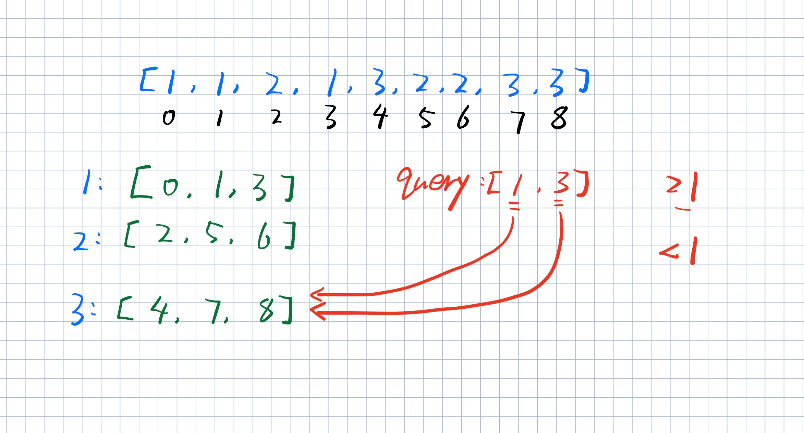

# [34. 在排序数组中查找元素的第一个和最后一个位置](https://leetcode.cn/problems/find-first-and-last-position-of-element-in-sorted-array/)

## 题目描述

给你一个按照非递减顺序排列的整数数组 `nums`，和一个目标值 `target`。请你找出给定目标值在数组中的开始位置和结束位置。

如果数组中不存在目标值 `target`，返回 `[-1, -1]`。

你必须设计并实现时间复杂度为 `O(log n)` 的算法解决此问题。

 

**示例 1：**

```
输入：nums = [5,7,7,8,8,10], target = 8
输出：[3,4]
```

**示例 2：**

```
输入：nums = [5,7,7,8,8,10], target = 6
输出：[-1,-1]
```

**示例 3：**

```
输入：nums = [], target = 0
输出：[-1,-1]
```

 

**提示：**

- `0 <= nums.length <= 105`
- `-109 <= nums[i] <= 109`
- `nums` 是一个非递减数组
- `-109 <= target <= 109`

## 代码

```java
class Solution {
    public int[] searchRange(int[] nums, int target) {

        // 找到 target 第一次出现的位置（左边界）
        int start = lowerbound(nums, target);

        // 如果越界或该位置不是 target，说明不存在
        if (start == nums.length || nums[start] != target) {
            return new int[]{-1, -1};
        }

        // 右边界 = target+1 的左边界 - 1
        return new int[]{start, lowerbound(nums, target + 1) - 1};
    }

    // lowerbound：返回第一个 >= target 的位置
    public int lowerbound(int[] nums, int target) {

        int left = 0;
        int right = nums.length - 1;

        // 二分查找模板：寻找左边界
        while (right >= left) {

            int mid = left + (right - left) / 2;

            if (nums[mid] < target) {
                left = mid + 1;  // target 在右边
            } else {
                right = mid - 1;  // mid 可能是答案，继续往左收缩
            }
        }

        // left 最终停在第一个 >= target 的位置
        return left;
    }
}
```

# [35. 搜索插入位置](https://leetcode.cn/problems/search-insert-position/)

## 题目描述

给定一个排序数组和一个目标值，在数组中找到目标值，并返回其索引。如果目标值不存在于数组中，返回它将会被按顺序插入的位置。

请必须使用时间复杂度为 `O(log n)` 的算法。

 

**示例 1:**

```
输入: nums = [1,3,5,6], target = 5
输出: 2
```

**示例 2:**

```
输入: nums = [1,3,5,6], target = 2
输出: 1
```

**示例 3:**

```
输入: nums = [1,3,5,6], target = 7
输出: 4
```

 

**提示:**

- `1 <= nums.length <= 104`
- `-104 <= nums[i] <= 104`
- `nums` 为 **无重复元素** 的 **升序** 排列数组
- `-104 <= target <= 104`

## 代码

```java
class Solution {
    public int searchInsert(int[] nums, int target) {

        int left = 0;                 // 左边界
        int right = nums.length - 1;  // 右边界

        // 标准二分：寻找第一个 >= target 的位置（lower_bound）
        while (right >= left) {

            int mid = left + (right - left) / 2;

            if (nums[mid] >= target) {
                // mid 可能是答案，继续往左收缩
                right = mid - 1;
            } else {
                // target 在右侧
                left = mid + 1;
            }
        }

        // left 最终停在：
        // 第一个 >= target 的位置
        // 或者如果不存在，则是插入位置（数组末尾）
        return left;
    }
}
```

# [704. 二分查找](https://leetcode.cn/problems/binary-search/)

## 题目描述

给定一个 `n` 个元素有序的（升序）整型数组 `nums` 和一个目标值 `target` ，写一个函数搜索 `nums` 中的 `target`，如果 `target` 存在返回下标，否则返回 `-1`。

你必须编写一个具有 `O(log n)` 时间复杂度的算法。


**示例 1:**

```
输入: nums = [-1,0,3,5,9,12], target = 9
输出: 4
解释: 9 出现在 nums 中并且下标为 4
```

**示例 2:**

```
输入: nums = [-1,0,3,5,9,12], target = 2
输出: -1
解释: 2 不存在 nums 中因此返回 -1
```

 

**提示：**

1. 你可以假设 `nums` 中的所有元素是不重复的。
2. `n` 将在 `[1, 10000]`之间。
3. `nums` 的每个元素都将在 `[-9999, 9999]`之间。

## 代码

```java
class Solution {
    public int search(int[] nums, int target) {

        // 找到第一个 >= target 的位置
        int start = lowerbound(nums, target);

        // 如果越界，或者该位置不是 target，则说明不存在
        return start == nums.length || nums[start] != target ? -1 : start;
    }

    // lowerbound：返回第一个 >= target 的位置
    private int lowerbound(int[] nums, int target) {

        int left = 0;
        int right = nums.length - 1;

        // 二分查找（标准 lower_bound 模板）
        while (right >= left) {

            // 防止溢出的 mid 写法（偏右中点）
            int mid = right - (right - left) / 2;

            if (nums[mid] >= target) {
                // mid 可能是答案，继续向左找更小的
                right = mid - 1;
            } else {
                // target 在右侧
                left = mid + 1;
            }
        }

        // left 最终停在第一个 >= target 的位置
        return left;
    }
}
```

# [744. 寻找比目标字母大的最小字母](https://leetcode.cn/problems/find-smallest-letter-greater-than-target/)

## 题目描述

给你一个字符数组 `letters`，该数组按 **非递减顺序** 排序，以及一个字符 `target`。`letters` 里**至少有两个不同**的字符。

返回 `letters` 中大于 `target` 的最小的字符。如果不存在这样的字符，则返回 `letters` 的第一个字符。

 

**示例 1：**

```
输入: letters = ['c', 'f', 'j'], target = 'a'
输出: 'c'
解释：letters 中字典上比 'a' 大的最小字符是 'c'。
```

**示例 2:**

```
输入: letters = ['c','f','j'], target = 'c'
输出: 'f'
解释：letters 中字典顺序上大于 'c' 的最小字符是 'f'。
```

**示例 3:**

```
输入: letters = ['x','x','y','y'], target = 'z'
输出: 'x'
解释：letters 中没有一个字符在字典上大于 'z'，所以我们返回 letters[0]。
```

 

**提示：**

- `2 <= letters.length <= 104`
- `letters[i]` 是一个小写字母
- `letters` 按**非递减顺序**排序
- `letters` 最少包含两个不同的字母
- `target` 是一个小写字母

## 代码

```java
class Solution {
    public char nextGreatestLetter(char[] letters, char target) {

        // 找到第一个 > target 的字符位置
        // 这里用 (target + 1) 等价于“严格大于 target”
        int start = lowerbound(letters, (char)(target + 1));

        // 如果越界，说明不存在更大的字符，循环回到第一个
        return start == letters.length ? letters[0] : letters[start];
    }

    // lowerbound：返回第一个 >= target 的位置
    public int lowerbound(char[] letters, char target) {

        int left = 0;
        int right = letters.length - 1;

        // 二分查找：寻找第一个 >= target 的位置
        while (right >= left) {

            int mid = left + (right - left) / 2;

            if (letters[mid] >= target) {
                // mid 可能是答案，继续向左收缩
                right = mid - 1;
            } else {
                // target 在右侧
                left = mid + 1;
            }
        }

        // left 停在第一个 >= target 的位置
        return left;
    }
}
```


# [2529. 正整数和负整数的最大计数](https://leetcode.cn/problems/maximum-count-of-positive-integer-and-negative-integer/)

## 题目描述

给你一个按 **非递减顺序** 排列的数组 `nums` ，返回正整数数目和负整数数目中的最大值。

- 换句话讲，如果 `nums` 中正整数的数目是 `pos` ，而负整数的数目是 `neg` ，返回 `pos` 和 `neg`二者中的最大值。

**注意：**`0` 既不是正整数也不是负整数。

 

**示例 1：**

```
输入：nums = [-2,-1,-1,1,2,3]
输出：3
解释：共有 3 个正整数和 3 个负整数。计数得到的最大值是 3 。
```

**示例 2：**

```
输入：nums = [-3,-2,-1,0,0,1,2]
输出：3
解释：共有 2 个正整数和 3 个负整数。计数得到的最大值是 3 。
```

**示例 3：**

```
输入：nums = [5,20,66,1314]
输出：4
解释：共有 4 个正整数和 0 个负整数。计数得到的最大值是 4 。
```

 

**提示：**

- `1 <= nums.length <= 2000`
- `-2000 <= nums[i] <= 2000`
- `nums` 按 **非递减顺序** 排列。

 

**进阶：**你可以设计并实现时间复杂度为 `O(log(n))` 的算法解决此问题吗？

## 代码

```java
class Solution {
    public int maximumCount(int[] nums) {

        int n = nums.length;

        // lowerbound(nums, 1)
        // 找到第一个 >= 1 的位置
        // 即：正数的起始位置
        int pos = n - lowerbound(nums, 1);

        // lowerbound(nums, 0)
        // 找到第一个 >= 0 的位置
        // 即：非负数起始位置
        // 也等价于：负数个数
        int neg = lowerbound(nums, 0);

        // 返回正数和负数数量的最大值
        return Math.max(pos, neg);
    }

    // lowerbound：返回第一个 >= k 的位置
    public int lowerbound(int[] nums, int k) {

        int left = 0;
        int right = nums.length - 1;

        // 标准二分：寻找左边界
        while (right >= left) {

            int mid = left + (right - left) / 2;

            if (nums[mid] >= k) {
                // mid 可能是答案，继续往左找
                right = mid - 1;
            } else {
                // k 在右侧
                left = mid + 1;
            }
        }

        // left = 第一个 >= k 的位置
        return left;
    }
}
```

# [1385. 两个数组间的距离值](https://leetcode.cn/problems/find-the-distance-value-between-two-arrays/)

## 题目描述

给你两个整数数组 `arr1` ， `arr2` 和一个整数 `d` ，请你返回两个数组之间的 **距离值** 。

「**距离值**」 定义为符合此距离要求的元素数目：对于元素 `arr1[i]` ，不存在任何元素 `arr2[j]` 满足 `|arr1[i]-arr2[j]| <= d` 。

 

**示例 1：**

```
输入：arr1 = [4,5,8], arr2 = [10,9,1,8], d = 2
输出：2
解释：
对于 arr1[0]=4 我们有：
|4-10|=6 > d=2 
|4-9|=5 > d=2 
|4-1|=3 > d=2 
|4-8|=4 > d=2 
所以 arr1[0]=4 符合距离要求

对于 arr1[1]=5 我们有：
|5-10|=5 > d=2 
|5-9|=4 > d=2 
|5-1|=4 > d=2 
|5-8|=3 > d=2
所以 arr1[1]=5 也符合距离要求

对于 arr1[2]=8 我们有：
|8-10|=2 <= d=2
|8-9|=1 <= d=2
|8-1|=7 > d=2
|8-8|=0 <= d=2
存在距离小于等于 2 的情况，不符合距离要求 

故而只有 arr1[0]=4 和 arr1[1]=5 两个符合距离要求，距离值为 2
```

**示例 2：**

```
输入：arr1 = [1,4,2,3], arr2 = [-4,-3,6,10,20,30], d = 3
输出：2
```

**示例 3：**

```
输入：arr1 = [2,1,100,3], arr2 = [-5,-2,10,-3,7], d = 6
输出：1
```

 

**提示：**

- `1 <= arr1.length, arr2.length <= 500`
- `-10^3 <= arr1[i], arr2[j] <= 10^3`
- `0 <= d <= 100`

## 代码

```java
class Solution {
    public int findTheDistanceValue(int[] arr1, int[] arr2, int d) {

        Arrays.sort(arr2); // 对 arr2 排序，方便二分查找

        int ans = 0; // 满足条件的元素个数

        // 遍历 arr1 中的每个元素 n
        for (int n : arr1) {

            // 在 arr2 中找到第一个 >= (n - d) 的位置
            int left = lowerbound(arr2, n - d);

            // 判断是否存在 arr2[j] 在 [n-d, n+d] 区间内
            // 如果 left 越界 或 arr2[left] > n + d，说明没有任何元素落在范围内
            if (left == arr2.length || arr2[left] > n + d) {
                ans++;
            }
        }

        return ans;
    }

    // lowerbound：返回第一个 >= k 的位置
    public int lowerbound(int[] nums, int k) {

        int left = 0;
        int right = nums.length - 1;

        // 二分查找：寻找左边界
        while (right >= left) {

            int mid = left + (right - left) / 2;

            if (nums[mid] >= k) {
                // mid 可能是答案，继续往左找
                right = mid - 1;
            } else {
                // k 在右侧
                left = mid + 1;
            }
        }

        // left = 第一个 >= k 的位置
        return left;
    }
}
```

# [1170. 比较字符串最小字母出现频次](https://leetcode.cn/problems/compare-strings-by-frequency-of-the-smallest-character/)

## 题目描述

定义一个函数 `f(s)`，统计 `s` 中**（按字典序比较）最小字母的出现频次** ，其中 `s` 是一个非空字符串。

例如，若 `s = "dcce"`，那么 `f(s) = 2`，因为字典序最小字母是 `"c"`，它出现了 2 次。

现在，给你两个字符串数组待查表 `queries` 和词汇表 `words` 。对于每次查询 `queries[i]` ，需统计 `words` 中满足 `f(queries[i])` < `f(W)` 的 **词的数目** ，`W` 表示词汇表 `words` 中的每个词。

请你返回一个整数数组 `answer` 作为答案，其中每个 `answer[i]` 是第 `i` 次查询的结果。

 

**示例 1：**

```
输入：queries = ["cbd"], words = ["zaaaz"]
输出：[1]
解释：查询 f("cbd") = 1，而 f("zaaaz") = 3 所以 f("cbd") < f("zaaaz")。
```

**示例 2：**

```
输入：queries = ["bbb","cc"], words = ["a","aa","aaa","aaaa"]
输出：[1,2]
解释：第一个查询 f("bbb") < f("aaaa")，第二个查询 f("aaa") 和 f("aaaa") 都 > f("cc")。
```

 

**提示：**

- `1 <= queries.length <= 2000`
- `1 <= words.length <= 2000`
- `1 <= queries[i].length, words[i].length <= 10`
- `queries[i][j]`、`words[i][j]` 都由小写英文字母组成

## 代码

```java
class Solution {
    public int[] numSmallerByFrequency(String[] queries, String[] words) {

        int[] arr1 = new int[queries.length]; // 存 queries 的 f(s)
        int[] arr2 = new int[words.length];   // 存 words 的 f(s)

        // 计算每个 query 的“最小字符出现次数”
        for (int i = 0; i < queries.length; i++) {
            arr1[i] = cntFreq(queries[i]);
        }

        // 计算每个 word 的“最小字符出现次数”
        for (int i = 0; i < words.length; i++) {
            arr2[i] = cntFreq(words[i]);
        }

        // 排序 words 的频率数组，方便二分
        Arrays.sort(arr2);

        // 对每个 query，找有多少 word 的 f(word) > f(query)
        for (int i = 0; i < arr1.length; i++) {

            // 找第一个 >= (arr1[i] + 1) 的位置
            int low = lowerbound(arr2, arr1[i] + 1);

            // 右侧所有元素都满足 > arr1[i]
            arr1[i] = arr2.length - low;
        }

        return arr1;
    }

    // lowerbound：返回第一个 >= target 的位置
    public int lowerbound(int[] nums, int target) {

        int left = 0;
        int right = nums.length - 1;

        while (right >= left) {

            int mid = left + (right - left) / 2;

            if (nums[mid] >= target) {
                right = mid - 1; // 向左找更小的
            } else {
                left = mid + 1;
            }
        }

        return left;
    }

    // 计算字符串 f(s)：最小字符的出现次数
    public int cntFreq(String S) {

        char[] s = S.toCharArray();

        int index = s[0] - 'a';   // 当前最小字符的下标
        int[] cnt = new int[26];  // 统计字符频率

        for (char ch : s) {

            // 更新最小字符
            if (ch - 'a' < index) {
                index = ch - 'a';
            }

            cnt[ch - 'a']++;
        }

        // 返回最小字符出现次数
        return cnt[index];
    }
}
```

# [2300. 咒语和药水的成功对数](https://leetcode.cn/problems/successful-pairs-of-spells-and-potions/)

## 题目描述

给你两个正整数数组 `spells` 和 `potions` ，长度分别为 `n` 和 `m` ，其中 `spells[i]` 表示第 `i` 个咒语的能量强度，`potions[j]` 表示第 `j` 瓶药水的能量强度。

同时给你一个整数 `success` 。一个咒语和药水的能量强度 **相乘** 如果 **大于等于** `success` ，那么它们视为一对 **成功** 的组合。

请你返回一个长度为 `n` 的整数数组 `pairs`，其中 `pairs[i]` 是能跟第 `i` 个咒语成功组合的 **药水** 数目。

 

**示例 1：**

```
输入：spells = [5,1,3], potions = [1,2,3,4,5], success = 7
输出：[4,0,3]
解释：
- 第 0 个咒语：5 * [1,2,3,4,5] = [5,10,15,20,25] 。总共 4 个成功组合。
- 第 1 个咒语：1 * [1,2,3,4,5] = [1,2,3,4,5] 。总共 0 个成功组合。
- 第 2 个咒语：3 * [1,2,3,4,5] = [3,6,9,12,15] 。总共 3 个成功组合。
所以返回 [4,0,3] 。
```

**示例 2：**

```
输入：spells = [3,1,2], potions = [8,5,8], success = 16
输出：[2,0,2]
解释：
- 第 0 个咒语：3 * [8,5,8] = [24,15,24] 。总共 2 个成功组合。
- 第 1 个咒语：1 * [8,5,8] = [8,5,8] 。总共 0 个成功组合。
- 第 2 个咒语：2 * [8,5,8] = [16,10,16] 。总共 2 个成功组合。
所以返回 [2,0,2] 。
```

 

**提示：**

- `n == spells.length`
- `m == potions.length`
- `1 <= n, m <= 105`
- `1 <= spells[i], potions[i] <= 105`
- `1 <= success <= 1010`

## 代码

```java
class Solution {
    public int[] successfulPairs(int[] spells, int[] potions, long success) {

        Arrays.sort(potions); // 排序 potions，方便二分查找

        int n = potions.length;

        // 遍历每个 spell，计算它能匹配多少 potion
        for (int i = 0; i < spells.length; i++) {

            int num = spells[i];

            // 计算最小需要的 potion 值：
            // num * potion >= success
            // => potion >= success / num（向上取整）
            long target = success % num == 0
                    ? success / num
                    : success / num + 1;

            // 找到第一个 >= target 的位置
            int idx = lowerbound(potions, target);

            // 右侧所有 potion 都满足条件
            spells[i] = n - idx;
        }

        return spells;
    }

    // lowerbound：返回第一个 >= target 的位置
    public int lowerbound(int[] nums, long target) {

        int left = 0;
        int right = nums.length - 1;

        // 二分查找左边界
        while (right >= left) {

            int mid = left + (right - left) / 2;

            if (nums[mid] >= target) {
                // mid 可能是答案，继续向左收缩
                right = mid - 1;
            } else {
                // target 在右侧
                left = mid + 1;
            }
        }

        // left = 第一个 >= target 的位置
        return left;
    }
}
```

# [2389. 和有限的最长子序列](https://leetcode.cn/problems/longest-subsequence-with-limited-sum/)

## 题目描述

给你一个长度为 `n` 的整数数组 `nums` ，和一个长度为 `m` 的整数数组 `queries` 。

返回一个长度为 `m` 的数组 `answer` ，其中 `answer[i]` 是 `nums` 中 元素之和小于等于 `queries[i]` 的 **子序列** 的 **最大** 长度 。

**子序列** 是由一个数组删除某些元素（也可以不删除）但不改变剩余元素顺序得到的一个数组。

 

**示例 1：**

```
输入：nums = [4,5,2,1], queries = [3,10,21]
输出：[2,3,4]
解释：queries 对应的 answer 如下：
- 子序列 [2,1] 的和小于或等于 3 。可以证明满足题目要求的子序列的最大长度是 2 ，所以 answer[0] = 2 。
- 子序列 [4,5,1] 的和小于或等于 10 。可以证明满足题目要求的子序列的最大长度是 3 ，所以 answer[1] = 3 。
- 子序列 [4,5,2,1] 的和小于或等于 21 。可以证明满足题目要求的子序列的最大长度是 4 ，所以 answer[2] = 4 。
```

**示例 2：**

```
输入：nums = [2,3,4,5], queries = [1]
输出：[0]
解释：空子序列是唯一一个满足元素和小于或等于 1 的子序列，所以 answer[0] = 0 。
```

 

**提示：**

- `n == nums.length`
- `m == queries.length`
- `1 <= n, m <= 1000`
- `1 <= nums[i], queries[i] <= 106`

## 代码

```java
class Solution {
    public int[] answerQueries(int[] nums, int[] queries) {

        Arrays.sort(nums);   // 排序：让小的数优先选，方便做前缀和

        prefixSum(nums);     // 转换成前缀和数组

        // 对每个 query，用二分找到“最大可选元素个数”
        for (int i = 0; i < queries.length; i++) {

            // 找第一个 > queries[i] 的位置
            // 等价于：前缀和 <= queries[i] 的最大长度
            queries[i] = lowerbound(nums, queries[i] + 1);
        }

        return queries;
    }

    // lowerbound：返回第一个 >= target 的位置
    public int lowerbound(int[] nums, int target) {

        int left = 0;
        int right = nums.length - 1;

        while (right >= left) {

            int mid = left + (right - left) / 2;

            if (nums[mid] >= target) {
                // mid 可能是答案，往左收缩
                right = mid - 1;
            } else {
                // target 在右边
                left = mid + 1;
            }
        }

        // left = 第一个 >= target 的位置
        return left;
    }

    // 转换为前缀和数组
    public void prefixSum(int[] nums) {

        for (int i = 1; i < nums.length; i++) {
            nums[i] += nums[i - 1];
        }
    }
}
```

# [981. 基于时间的键值存储](https://leetcode.cn/problems/time-based-key-value-store/)

## 题目描述

设计一个基于时间的键值数据结构，该结构可以在不同时间戳存储对应同一个键的多个值，并针对特定时间戳检索键对应的值。

实现 `TimeMap` 类：

- `TimeMap()` 初始化数据结构对象
- `void set(String key, String value, int timestamp)` 存储给定时间戳 `timestamp` 时的键 `key` 和值 `value`。
- `String get(String key, int timestamp)` 返回一个值，该值在之前调用了 `set`，其中 `timestamp_prev <= timestamp` 。如果有多个这样的值，它将返回与最大  `timestamp_prev` 关联的值。如果没有值，则返回空字符串（`""`）。

 

**示例 1：**

```
输入：
["TimeMap", "set", "get", "get", "set", "get", "get"]
[[], ["foo", "bar", 1], ["foo", 1], ["foo", 3], ["foo", "bar2", 4], ["foo", 4], ["foo", 5]]
输出：
[null, null, "bar", "bar", null, "bar2", "bar2"]

解释：
TimeMap timeMap = new TimeMap();
timeMap.set("foo", "bar", 1);  // 存储键 "foo" 和值 "bar" ，时间戳 timestamp = 1   
timeMap.get("foo", 1);         // 返回 "bar"
timeMap.get("foo", 3);         // 返回 "bar", 因为在时间戳 3 和时间戳 2 处没有对应 "foo" 的值，所以唯一的值位于时间戳 1 处（即 "bar"） 。
timeMap.set("foo", "bar2", 4); // 存储键 "foo" 和值 "bar2" ，时间戳 timestamp = 4  
timeMap.get("foo", 4);         // 返回 "bar2"
timeMap.get("foo", 5);         // 返回 "bar2"
```

 

**提示：**

- `1 <= key.length, value.length <= 100`
- `key` 和 `value` 由小写英文字母和数字组成
- `1 <= timestamp <= 107`
- `set` 操作中的时间戳 `timestamp` 都是严格递增的
- 最多调用 `set` 和 `get` 操作 `2 * 105` 次

## 代码

```java
class Pair {
    int timestamp;
    String value;

    public Pair(int timestamp, String value) {
        this.timestamp = timestamp;
        this.value = value;
    }
}

class TimeMap {

    // key -> 按时间顺序存储 (timestamp, value)
    Map<String, List<Pair>> map;

    public TimeMap() {
        this.map = new HashMap<>();
    }

    // 存储操作：直接追加到 list 末尾（保证时间递增）
    public void set(String key, String value, int timestamp) {
        List<Pair> list = map.getOrDefault(key, new ArrayList<>());
        list.add(new Pair(timestamp, value));
        map.put(key, list);
    }

    // 查询：返回 <= timestamp 的最新 value
    public String get(String key, int timestamp) {

        List<Pair> list = map.getOrDefault(key, null);

        // 如果 key 不存在，直接返回空
        if (list == null || list.isEmpty()) return "";

        int left = 0;
        int right = list.size() - 1;

        // 二分查找：找最后一个 timestamp <= target 的位置
        while (left <= right) {

            int mid = left + (right - left) / 2;
            Pair pair = list.get(mid);

            // 如果当前时间 > target 时间，说明答案在左边
            if (pair.timestamp > timestamp) {
                right = mid - 1;
            } else {
                // 当前时间 <= target，可能是答案，往右找更大的
                left = mid + 1;
            }
        }

        // left 停在第一个 > timestamp 的位置
        // 所以 left - 1 是最后一个 <= timestamp 的位置
        return left > 0 ? list.get(left - 1).value : "";
    }
}

/**
 * Your TimeMap object will be instantiated and called as such:
 * TimeMap obj = new TimeMap();
 * obj.set(key,value,timestamp);
 * String param_2 = obj.get(key,timestamp);
 */
```

# [1182. 与目标颜色间的最短距离](https://leetcode.cn/problems/shortest-distance-to-target-color/)

## 题目描述

给你一个数组 `colors`，里面有 `1`、`2`、 `3` 三种颜色。

我们需要在 `colors` 上进行一些查询操作 `queries`，其中每个待查项都由两个整数 `i` 和 `c` 组成。

现在请你帮忙设计一个算法，查找从索引 `i` 到具有目标颜色 `c` 的元素之间的最短距离。

如果不存在解决方案，请返回 `-1`。

 

**示例 1：**

```
输入：colors = [1,1,2,1,3,2,2,3,3], queries = [[1,3],[2,2],[6,1]]
输出：[3,0,3]
解释： 
距离索引 1 最近的颜色 3 位于索引 4（距离为 3）。
距离索引 2 最近的颜色 2 就是它自己（距离为 0）。
距离索引 6 最近的颜色 1 位于索引 3（距离为 3）。
```

**示例 2：**

```
输入：colors = [1,2], queries = [[0,3]]
输出：[-1]
解释：colors 中没有颜色 3。
```

 

**提示：**

- `1 <= colors.length <= 5*10^4`
- `1 <= colors[i] <= 3`
- `1 <= queries.length <= 5*10^4`
- `queries[i].length == 2`
- `0 <= queries[i][0] < colors.length`
- `1 <= queries[i][1] <= 3`

## 图解思路



## 代码

```java
class Solution {
    public List<Integer> shortestDistanceColor(int[] colors, int[][] queries) {

        // num[i]：存颜色 i 出现的位置下标（有序）
        List<Integer>[] num = new ArrayList[4];

        // 结果列表
        List<Integer> ans = new ArrayList<>();

        // 初始化 3 种颜色（1~3）
        for (int i = 0; i < 4; i++) {
            num[i] = new ArrayList<>();
        }

        // 预处理：记录每种颜色出现的所有位置
        for (int i = 0; i < colors.length; i++) {
            num[colors[i]].add(i);
        }

        // 处理每个查询
        for (int i = 0; i < queries.length; i++) {

            int idx = queries[i][0];   // 目标位置
            int color = queries[i][1]; // 目标颜色

            // 如果该颜色不存在，直接返回 -1
            if (num[color].isEmpty()) {
                ans.add(-1);
                continue;
            }

            int left = 0;
            int right = num[color].size() - 1;

            // 二分：找到第一个 >= idx 的位置
            while (right >= left) {

                int mid = left + (right - left) / 2;

                if (num[color].get(mid) >= idx) {
                    right = mid - 1;
                } else {
                    left = mid + 1;
                }
            }

            // left 是第一个 >= idx 的位置

            // 情况1：所有位置都 < idx
            if (left == num[color].size()) {
                ans.add(Math.abs(idx - num[color].get(left - 1)));

            }
            // 情况2：左右都可能存在最近点
            else if (left > 0) {
                int leftDist = Math.abs(idx - num[color].get(left - 1));
                int rightDist = Math.abs(num[color].get(left) - idx);
                ans.add(Math.min(leftDist, rightDist));

            }
            // 情况3：只有右边有
            else {
                ans.add(Math.abs(num[color].get(left) - idx));
            }
        }

        return ans;
    }
}
```

