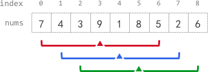

# 1456. 定长子串中元音的最大数目

## 题目描述

给你字符串 `s` 和整数 `k` 。

请返回字符串 `s` 中长度为 `k` 的单个子字符串中可能包含的最大元音字母数。

英文中的 **元音字母** 为（`a`, `e`, `i`, `o`, `u`）。

 

**示例 1：**

```
输入：s = "abciiidef", k = 3
输出：3
解释：子字符串 "iii" 包含 3 个元音字母。
```

**示例 2：**

```
输入：s = "aeiou", k = 2
输出：2
解释：任意长度为 2 的子字符串都包含 2 个元音字母。
```

**示例 3：**

```
输入：s = "leetcode", k = 3
输出：2
解释："lee"、"eet" 和 "ode" 都包含 2 个元音字母。
```

**示例 4：**

```
输入：s = "rhythms", k = 4
输出：0
解释：字符串 s 中不含任何元音字母。
```

**示例 5：**

```
输入：s = "tryhard", k = 4
输出：1
```

 

**提示：**

- `1 <= s.length <= 10^5`
- `s` 由小写英文字母组成
- `1 <= k <= s.length`

## 解题思路

**定长滑窗三步法**

| 步骤         | 操作                                    | 时机                          |
| :----------- | :-------------------------------------- | :---------------------------- |
| **入**       | 右端点 `i` 进入窗口，更新统计量         | 每轮必做                      |
| **更新答案** | 用统计量更新最优解                      | 窗口已形成（`i - k + 1 ≥ 0`） |
| **出**       | 左端点 `i - k + 1` 离开窗口，更新统计量 | 窗口已形成后                  |

## 代码

```java
class Solution {

    public boolean isVowel(char ch){
        if(ch=='a' || ch=='e' || ch=='i' ||ch=='o' ||ch=='u') return true;
        return false;
    }

    public int maxVowels(String s, int k) {
        int result = 0;
        char[] chs = s.toCharArray();
        int count = 0;
        for(int i=0; i<k-1; i++){
            if(isVowel(chs[i])) count++;
        }

        for(int i=k-1; i<chs.length; i++){
            // 右端点加入
            if(isVowel(chs[i])) count++;
            // 更新
            result = Math.max(result, count);
            if(result==k) return result;
            // 左端点取出
            if(isVowel(chs[i-k+1])) count--;
       }

        return result;
    }
}
```

# 643. 子数组最大平均数 I

## 题目描述

给你一个由 `n` 个元素组成的整数数组 `nums` 和一个整数 `k` 。

请你找出平均数最大且 **长度为 `k`** 的连续子数组，并输出该最大平均数。

任何误差小于 `10-5` 的答案都将被视为正确答案。

 

**示例 1：**

```
输入：nums = [1,12,-5,-6,50,3], k = 4
输出：12.75
解释：最大平均数 (12-5-6+50)/4 = 51/4 = 12.75
```

**示例 2：**

```
输入：nums = [5], k = 1
输出：5.00000
```

 

**提示：**

- `n == nums.length`
- `1 <= k <= n <= 105`
- `-104 <= nums[i] <= 104`

##  代码

```java
class Solution {
    public double findMaxAverage(int[] nums, int k) {
        double sum = 0;
        double ans = -Double.MAX_VALUE;

        // 预处理：先让前 k-1 个元素入窗，形成"半满"窗口
        for(int i = 0; i < k - 1; i++){
            sum += nums[i];
        }

        // 从第 k 个元素开始，每次循环形成一个完整窗口
        for(int i = k - 1; i < nums.length; i++){
            sum += nums[i];                     // 入：右端点 i 进入窗口
            ans = Math.max(ans, sum);           // 更新：用窗口和更新最大和
            sum -= nums[i - k + 1];             // 出：左端点 i-k+1 离开窗口
        }
        return ans / k;                         // 最大平均数 = 最大和 / k
    }
}
```

# 1343. 大小为 K 且平均值大于等于阈值的子数组数目

## 题目描述

给你一个整数数组 `arr` 和两个整数 `k` 和 `threshold` 。

请你返回长度为 `k` 且平均值大于等于 `threshold` 的子数组数目。

 

**示例 1：**

```
输入：arr = [2,2,2,2,5,5,5,8], k = 3, threshold = 4
输出：3
解释：子数组 [2,5,5],[5,5,5] 和 [5,5,8] 的平均值分别为 4，5 和 6 。其他长度为 3 的子数组的平均值都小于 4 （threshold 的值)。
```

**示例 2：**

```
输入：arr = [11,13,17,23,29,31,7,5,2,3], k = 3, threshold = 5
输出：6
解释：前 6 个长度为 3 的子数组平均值都大于 5 。注意平均值不是整数。
```

 

**提示：**

- `1 <= arr.length <= 105`
- `1 <= arr[i] <= 104`
- `1 <= k <= arr.length`
- `0 <= threshold <= 104`

## 代码

```java
class Solution {
    public int numOfSubarrays(int[] arr, int k, int threshold) {
        int ans = 0;
        int sum = 0;

        // 预处理：先让前 k-1 个元素入窗
        for(int i = 0; i < k - 1; i++){
            sum += arr[i];
        }

        // 主循环：从第 k 个元素开始，每次形成一个完整窗口
        for(int i = k - 1; i < arr.length; i++){
            sum += arr[i];                          // 入：右端点 i 进入窗口
            if(sum / k >= threshold) ans++;         // 更新：平均数达标则计数
            sum -= arr[i - k + 1];                  // 出：左端点 i-k+1 离开窗口
        }

        return ans;
    }
}
```

# 2090. 半径为 k 的子数组平均值

## 题目描述

给你一个下标从 **0** 开始的数组 `nums` ，数组中有 `n` 个整数，另给你一个整数 `k` 。

**半径为 k 的子数组平均值** 是指：`nums` 中一个以下标 `i` 为 **中心** 且 **半径** 为 `k` 的子数组中所有元素的平均值，即下标在 `i - k` 和 `i + k` 范围（**含** `i - k` 和 `i + k`）内所有元素的平均值。如果在下标 `i` 前或后不足 `k` 个元素，那么 **半径为 k 的子数组平均值** 是 `-1` 。

构建并返回一个长度为 `n` 的数组 `avgs` ，其中 `avgs[i]` 是以下标 `i` 为中心的子数组的 **半径为 k 的子数组平均值** 。

`x` 个元素的 **平均值** 是 `x` 个元素相加之和除以 `x` ，此时使用截断式 **整数除法** ，即需要去掉结果的小数部分。

- 例如，四个元素 `2`、`3`、`1` 和 `5` 的平均值是 `(2 + 3 + 1 + 5) / 4 = 11 / 4 = 2.75`，截断后得到 `2` 。

 

**示例 1：**



```
输入：nums = [7,4,3,9,1,8,5,2,6], k = 3
输出：[-1,-1,-1,5,4,4,-1,-1,-1]
解释：
- avg[0]、avg[1] 和 avg[2] 是 -1 ，因为在这几个下标前的元素数量都不足 k 个。
- 中心为下标 3 且半径为 3 的子数组的元素总和是：7 + 4 + 3 + 9 + 1 + 8 + 5 = 37 。
  使用截断式 整数除法，avg[3] = 37 / 7 = 5 。
- 中心为下标 4 的子数组，avg[4] = (4 + 3 + 9 + 1 + 8 + 5 + 2) / 7 = 4 。
- 中心为下标 5 的子数组，avg[5] = (3 + 9 + 1 + 8 + 5 + 2 + 6) / 7 = 4 。
- avg[6]、avg[7] 和 avg[8] 是 -1 ，因为在这几个下标后的元素数量都不足 k 个。
```

**示例 2：**

```
输入：nums = [100000], k = 0
输出：[100000]
解释：
- 中心为下标 0 且半径 0 的子数组的元素总和是：100000 。
  avg[0] = 100000 / 1 = 100000 。
```

**示例 3：**

```
输入：nums = [8], k = 100000
输出：[-1]
解释：
- avg[0] 是 -1 ，因为在下标 0 前后的元素数量均不足 k 。
```

 

**提示：**

- `n == nums.length`
- `1 <= n <= 105`
- `0 <= nums[i], k <= 105`

## 代码

```java
class Solution {
    public int[] getAverages(int[] nums, int k) {
        int[] ans = new int[nums.length];
        long sum = 0;
        Arrays.fill(ans, -1);                   // 无法形成窗口的位置默认为 -1

        if(2 * k + 1 > nums.length) return ans;  // 数组太短，无法形成任何窗口

        // 预处理：先让前 2k 个元素入窗（窗口总长为 2k+1，还需 1 个）
        for(int i = 0; i < 2 * k; i++){
            sum += nums[i];
        }

        // 主循环：从第 2k+1 个元素开始，每次形成一个完整窗口
        for(int i = 2 * k; i < nums.length; i++){
            sum += nums[i];                         // 入：右端点 i 进入窗口
            ans[i - k] = (int)(sum / (2 * k + 1));  // 更新：中心下标 i-k 处的平均值
            sum -= nums[i - 2 * k];                 // 出：左端点 i-2k 离开窗口
        }

        return ans;
    }
}
```

# 2379. 得到 K 个黑块的最少涂色次数

## 题目描述

给你一个长度为 `n` 下标从 **0** 开始的字符串 `blocks` ，`blocks[i]` 要么是 `'W'` 要么是 `'B'` ，表示第 `i` 块的颜色。字符 `'W'` 和 `'B'` 分别表示白色和黑色。

给你一个整数 `k` ，表示想要 **连续** 黑色块的数目。

每一次操作中，你可以选择一个白色块将它 **涂成** 黑色块。

请你返回至少出现 **一次** 连续 `k` 个黑色块的 **最少** 操作次数。

 

**示例 1：**

```
输入：blocks = "WBBWWBBWBW", k = 7
输出：3
解释：
一种得到 7 个连续黑色块的方法是把第 0 ，3 和 4 个块涂成黑色。
得到 blocks = "BBBBBBBWBW" 。
可以证明无法用少于 3 次操作得到 7 个连续的黑块。
所以我们返回 3 。
```

**示例 2：**

```
输入：blocks = "WBWBBBW", k = 2
输出：0
解释：
不需要任何操作，因为已经有 2 个连续的黑块。
所以我们返回 0 。
```

 

**提示：**

- `n == blocks.length`
- `1 <= n <= 100`
- `blocks[i]` 要么是 `'W'` ，要么是 `'B'` 。
- `1 <= k <= n`

## 代码

```java
class Solution {
    public int minimumRecolors(String blocks, int k) {
        char[] s = blocks.toCharArray();
        int ans = k;                            // 最坏情况：全染白，最多 k 次
        int count = 0;                          // 窗口内 'B' 的个数

        // 预处理：先让前 k-1 个字符入窗
        for(int i = 0; i < k - 1; i++){
            if(s[i] == 'B') count++;
        }

        // 主循环：从第 k 个字符开始，每次形成一个完整窗口
        for(int i = k - 1; i < s.length; i++){
            if(s[i] == 'B') count++;            // 入：右端点 i 进入窗口
            ans = Math.min(ans, k - count);     // 更新：需要染色的次数 = 窗口长度 - 黑块数
            if(s[i - k + 1] == 'B') count--;    // 出：左端点 i-k+1 离开窗口
        }

        return ans;
    }
}
```

# 2841. 几乎唯一子数组的最大和

## 题目描述

给你一个整数数组 `nums` 和两个正整数 `m` 和 `k` 。

请你返回 `nums` 中长度为 `k` 的 **几乎唯一** 子数组的 **最大和** ，如果不存在几乎唯一子数组，请你返回 `0` 。

如果 `nums` 的一个子数组有至少 `m` 个互不相同的元素，我们称它是 **几乎唯一** 子数组。

子数组指的是一个数组中一段连续 **非空** 的元素序列。

 

**示例 1：**

```
输入：nums = [2,6,7,3,1,7], m = 3, k = 4
输出：18
解释：总共有 3 个长度为 k = 4 的几乎唯一子数组。分别为 [2, 6, 7, 3] ，[6, 7, 3, 1] 和 [7, 3, 1, 7] 。这些子数组中，和最大的是 [2, 6, 7, 3] ，和为 18 。
```

**示例 2：**

```
输入：nums = [5,9,9,2,4,5,4], m = 1, k = 3
输出：23
解释：总共有 5 个长度为 k = 3 的几乎唯一子数组。分别为 [5, 9, 9] ，[9, 9, 2] ，[9, 2, 4] ，[2, 4, 5] 和 [4, 5, 4] 。这些子数组中，和最大的是 [5, 9, 9] ，和为 23 。
```

**示例 3：**

```
输入：nums = [1,2,1,2,1,2,1], m = 3, k = 3
输出：0
解释：输入数组中不存在长度为 k = 3 的子数组含有至少  m = 3 个互不相同元素的子数组。所以不存在几乎唯一子数组，最大和为 0 。
```

 

**提示：**

- `1 <= nums.length <= 2 * 104`
- `1 <= m <= k <= nums.length`
- `1 <= nums[i] <= 109`

##  代码

```java
class Solution {
    public long maxSum(List<Integer> nums, int m, int k) {
        Map<Integer, Integer> map = new HashMap<>();  // 统计窗口内各数字出现次数

        int type = 0;    // 窗口内不同数字的种类数
        long sum = 0;    // 窗口内元素和
        long ans = 0;    // 满足条件的最大和

        // 预处理：先让前 k-1 个元素入窗
        for(int i = 0; i < k - 1; i++){
            int num = nums.get(i);
            int count = map.getOrDefault(num, 0);
            if(count == 0) type++;      // 新种类出现
            map.put(num, count + 1);
            sum += num;
        }

        // 主循环：从第 k 个元素开始
        for(int i = k - 1; i < nums.size(); i++){
            int in = nums.get(i);           // 即将进入窗口的元素
            int out = nums.get(i - k + 1);  // 即将离开窗口的元素

            // 入
            sum += in;
            int count = map.getOrDefault(in, 0);
            if(count == 0) type++;          // 新种类进入
            map.put(in, count + 1);

            // 更新
            if(type >= m){                  // 种类数不少于 m 才合法
                ans = Math.max(ans, sum);
            }

            // 出
            sum -= out;
            count = map.get(out);
            if(count == 1) type--;          // 该种类只剩一个，离开后种类数减 1
            map.put(out, count - 1);
        }

        return ans;
    }
}
```

# 2461. 长度为 K 子数组中的最大和

## 题目描述

给你一个整数数组 `nums` 和一个整数 `k` 。请你从 `nums` 中满足下述条件的全部子数组中找出最大子数组和：

- 子数组的长度是 `k`，且
- 子数组中的所有元素 **各不相同 。**

返回满足题面要求的最大子数组和。如果不存在子数组满足这些条件，返回 `0` 。

**子数组** 是数组中一段连续非空的元素序列。

 

**示例 1：**

```
输入：nums = [1,5,4,2,9,9,9], k = 3
输出：15
解释：nums 中长度为 3 的子数组是：
- [1,5,4] 满足全部条件，和为 10 。
- [5,4,2] 满足全部条件，和为 11 。
- [4,2,9] 满足全部条件，和为 15 。
- [2,9,9] 不满足全部条件，因为元素 9 出现重复。
- [9,9,9] 不满足全部条件，因为元素 9 出现重复。
因为 15 是满足全部条件的所有子数组中的最大子数组和，所以返回 15 。
```

**示例 2：**

```
输入：nums = [4,4,4], k = 3
输出：0
解释：nums 中长度为 3 的子数组是：
- [4,4,4] 不满足全部条件，因为元素 4 出现重复。
因为不存在满足全部条件的子数组，所以返回 0 。
```

 

**提示：**

- `1 <= k <= nums.length <= 105`
- `1 <= nums[i] <= 105`

## 代码

```java
class Solution {
   public long maximumSubarraySum(int[] nums, int k) {
       Map<Integer, Integer> map = new HashMap<>();  // 统计窗口内各数字出现次数

       long sum = 0;    // 窗口内元素和
       long ans = 0;    // 满足条件的最大和
       int type = 0;    // 窗口内不同数字的种类数

       // 预处理：先让前 k-1 个元素入窗
       for(int i = 0; i < k - 1; i++){
           int count = map.getOrDefault(nums[i], 0);
           if(count == 0) type++;          // 新种类出现
           map.put(nums[i], count + 1);
           sum += nums[i];
       }

       // 主循环：从第 k 个元素开始
       for(int i = k - 1; i < nums.length; i++){
           // 入
           int count = map.getOrDefault(nums[i], 0);
           if(count == 0) type++;          // 新种类进入
           map.put(nums[i], count + 1);
           sum += nums[i];

           // 更新
           if(type == k){                  // k 个元素互不相同（无重复）
               ans = Math.max(ans, sum);
           }

           // 出
           count = map.get(nums[i - k + 1]);
           if(count == 1) type--;          // 该种类只剩一个，离开后种类数减 1
           map.put(nums[i - k + 1], count - 1);
           sum -= nums[i - k + 1];
       }

       return ans;
   }
}
```

# 1423. 可获得的最大点数

## 题目描述

几张卡牌 **排成一行**，每张卡牌都有一个对应的点数。点数由整数数组 `cardPoints` 给出。

每次行动，你可以从行的开头或者末尾拿一张卡牌，最终你必须正好拿 `k` 张卡牌。

你的点数就是你拿到手中的所有卡牌的点数之和。

给你一个整数数组 `cardPoints` 和整数 `k`，请你返回可以获得的最大点数。

 

**示例 1：**

```
输入：cardPoints = [1,2,3,4,5,6,1], k = 3
输出：12
解释：第一次行动，不管拿哪张牌，你的点数总是 1 。但是，先拿最右边的卡牌将会最大化你的可获得点数。最优策略是拿右边的三张牌，最终点数为 1 + 6 + 5 = 12 。
```

**示例 2：**

```
输入：cardPoints = [2,2,2], k = 2
输出：4
解释：无论你拿起哪两张卡牌，可获得的点数总是 4 。
```

**示例 3：**

```
输入：cardPoints = [9,7,7,9,7,7,9], k = 7
输出：55
解释：你必须拿起所有卡牌，可以获得的点数为所有卡牌的点数之和。
```

**示例 4：**

```
输入：cardPoints = [1,1000,1], k = 1
输出：1
解释：你无法拿到中间那张卡牌，所以可以获得的最大点数为 1 。 
```

**示例 5：**

```
输入：cardPoints = [1,79,80,1,1,1,200,1], k = 3
输出：202
```

 

**提示：**

- `1 <= cardPoints.length <= 10^5`
- `1 <= cardPoints[i] <= 10^4`
- `1 <= k <= cardPoints.length`

## 代码

模拟循环数组：
```java
class Solution {
    public int maxScore(int[] cardPoints, int k) {
        // 将数组复制一份拼接，模拟环形取牌（可从两端取，等价于在环上取连续 k 张）
        int[] newCards = new int[cardPoints.length * 2];
        for(int i = 0; i < newCards.length; i++){
            newCards[i] = cardPoints[i % cardPoints.length];
        }

        int sum = 0;
        int ans = 0;
        int n = cardPoints.length;

        // 预处理：窗口起点为 n-k（即从原数组末尾往前 k 个位置开始）
        // 先让前 k-1 个元素入窗
        for(int i = n - k; i < n - 1; i++){
            sum += newCards[i];
        }

        // 主循环：窗口在 [n-k, n+k-1] 范围内滑动，长度恒为 k
        for(int i = n - 1; i < n + k; i++){
            sum += newCards[i];             // 入：右端点 i 进入窗口
            ans = Math.max(ans, sum);       // 更新：维护最大得分
            sum -= newCards[i - k + 1];     // 出：左端点 i-k+1 离开窗口
        }

        return ans;
    }
}
```

逆向思维：

```java
class Solution {
    public int maxScore(int[] cardPoints, int k) {
        // 逆向思维：总和 - 中间连续子数组的最小和 = 两端最大和
        int sum = 0;            // 所有卡牌分数总和
        int ans = 0;            // 最大得分
        int len = cardPoints.length;
        int minusCount = len - k;  // 中间不取的连续卡牌数

        for(int card : cardPoints){
            sum += card;
        }
        if(k == len) return sum;   // 全取，直接返回总和

        int minus = 0;             // 滑动窗口：中间不取部分的和
        // 预处理：先让前 minusCount-1 个元素入窗
        for(int i = 0; i < minusCount - 1; i++){
            minus += cardPoints[i];
        }

        // 主循环：求长度为 minusCount 的连续子数组的最小和
        for(int i = minusCount - 1; i < len; i++){
            minus += cardPoints[i];                     // 入
            ans = Math.max(sum - minus, ans);            // 更新：总和 - 中间和 = 两端和
            minus -= cardPoints[i - minusCount + 1];    // 出
        }

        return ans;
    }
}
```

